Setup and Installation 
1. Install docker on your machine. 

curl -fsSL https://get.docker.com -o get-docker.sh
sudo sh ./get-docker.sh --dry-run

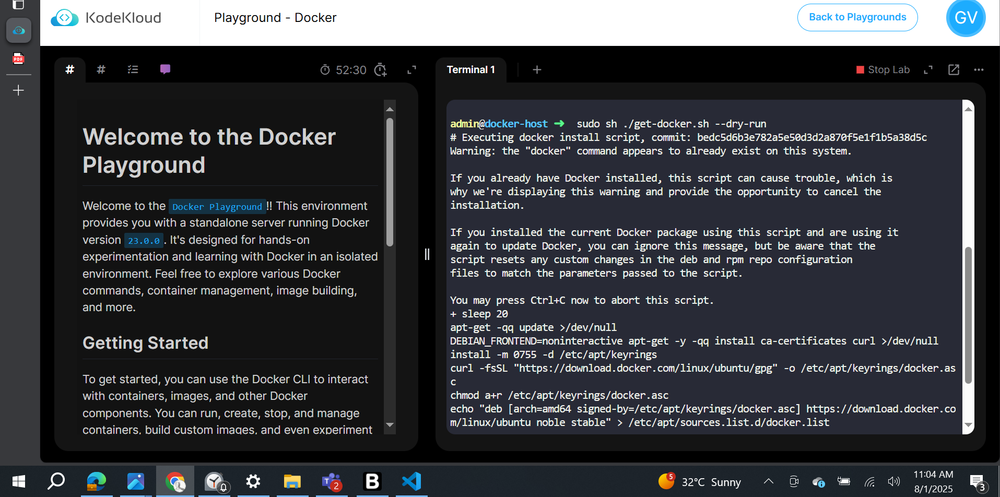

a. Verify the installation and ensure docker is enabled to run at restart. 
Basic Docker Commands 

docker --version 
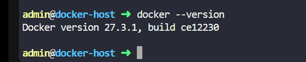

2. Run a hello-world container and notice how the container is run. 

docker run --name hellow-world hello-world

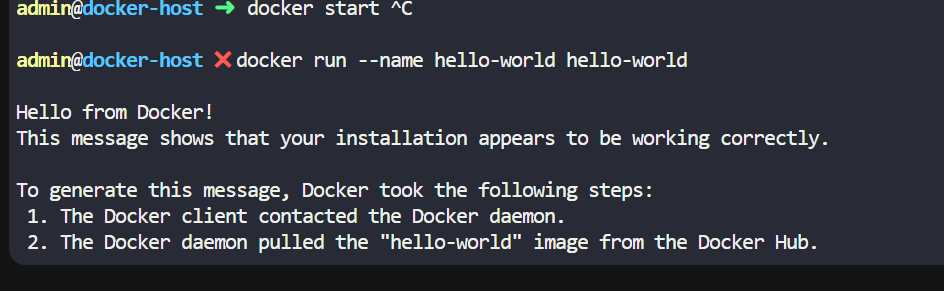

a. Show the containers running on Docker. Is the hello-world container 
still running?  

-No

b. How can you show the status of previously run containers? 

docker ps | grep "hello-world"

c. Was the hello-world image pulled automatically? Show that the image 
is now available on your local Docker environment. 

docker images | grep "hello-world"

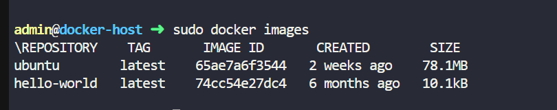

3. Pull a nginx image with the latest tag, run a container and name it my_nginx 
letting it sleep for 3600 seconds.  

docker run --name my_nginx nginx:latest sleep 3600
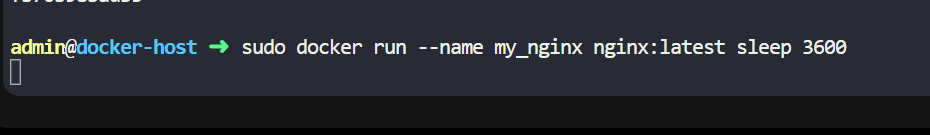

a. Is the container running on foreground or background? 

-running in forground by default

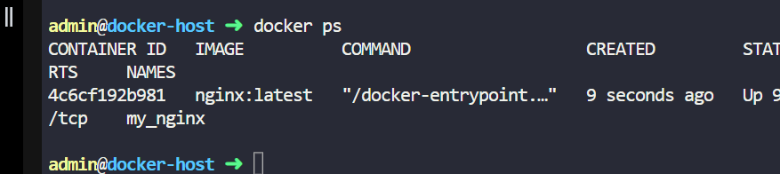

b. What option can we add to let it run in the background? 

add -d

Status: Downloaded newer image for nginx:latest
fb70b98bad3596f52a705ac4dd8ae56914e1027ac3739aa231e7d00b81b19842

admin@docker-host ➜  bg

4. Remove the my_nginx container.  

a. Are you able to do so?  
-No, because its still running

b. How can you remove the container? 
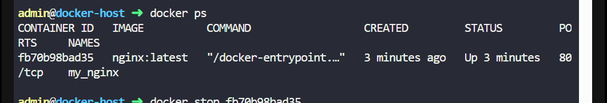
docker stop 
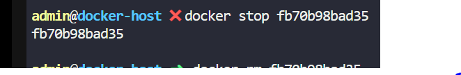
docker rm 

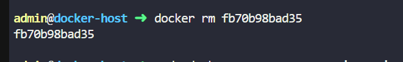

Port Mapping and Volume Mapping 

5. Using the nginx image, run another container named nginx_1 exposing the 
container port to 8888 on localhost. Open the webapp on your browser.  

docker run -p 8888:80 --name nginx_1 nginx:latest
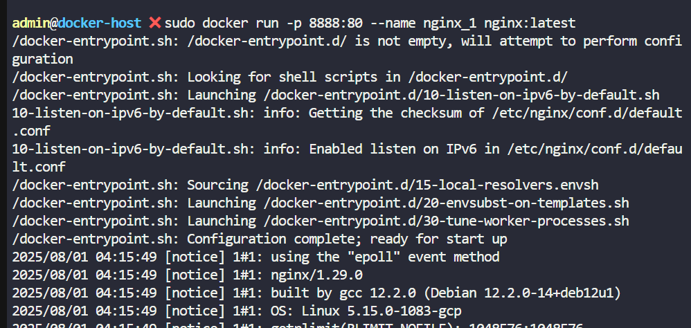

a. Stop the container after running 

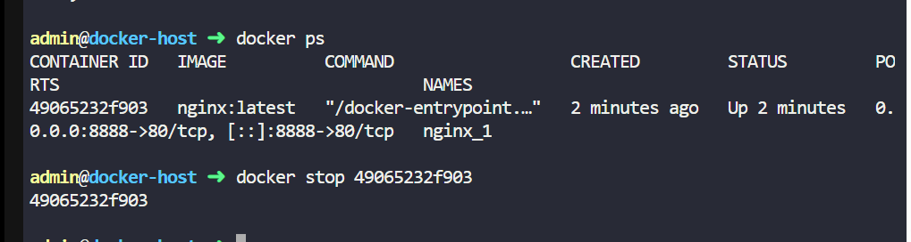

6. Create a directory named data and echo “Hello World” to a file index.html 
inside the directory. 
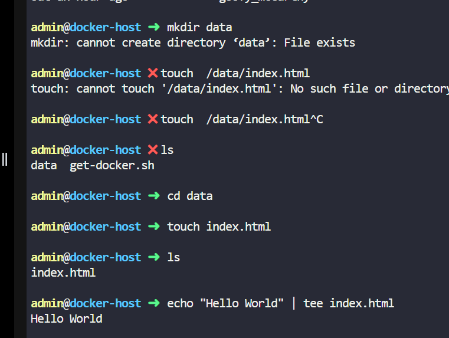

a. Run another nginx container named nginx_2 exposing it to 8888 on the 
localhost. 

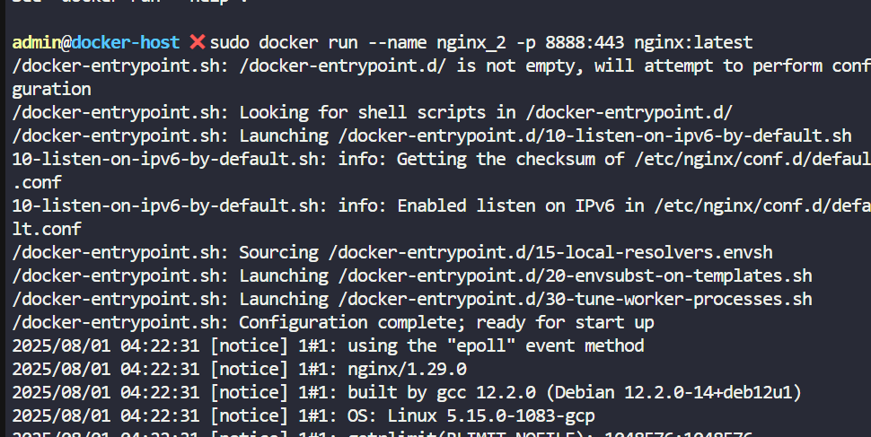

b. Open the nginx webapp on your browser. Reload the page so it reflects 
the correct text. 
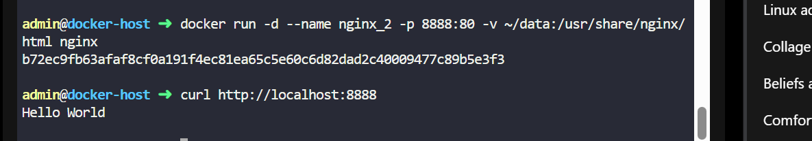

c. Notice that you may edit the html page inside the container and persist 
it in the attached directory but not the other way around. 
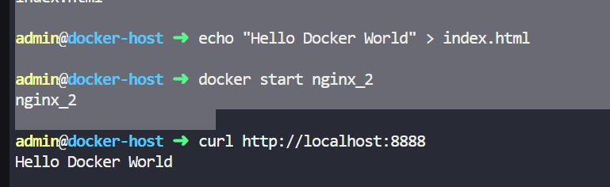

7. Create a volume called my_volume and run another nginx container named 
nginx3 attaching the volume to the nginx html directory and expose to the 
same port 

cannot run on the same port due to its already allocated to nginx 2

answer 1 rm the nginx2 or

answer 2 allocate it to different port 

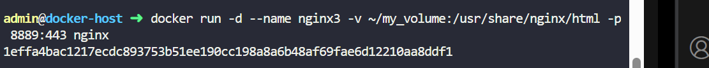

sudo docker volume create /data2

Creating Docker Images 
8. Login to your Docker Hub account. 
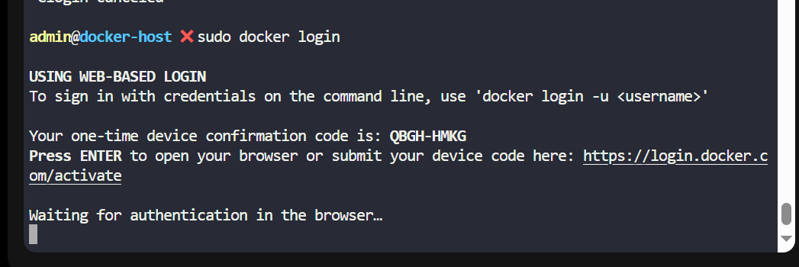

copy th code 
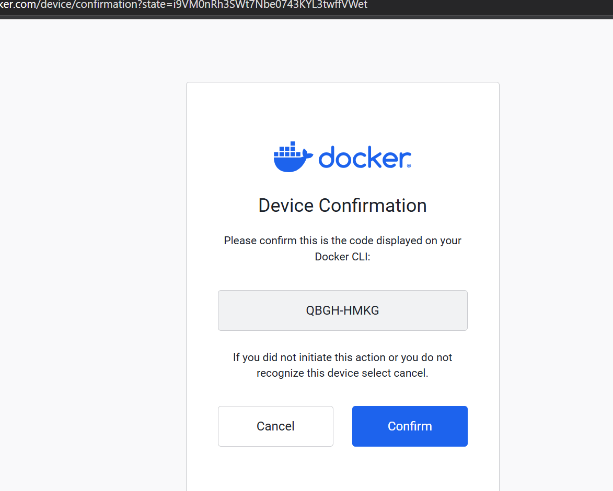

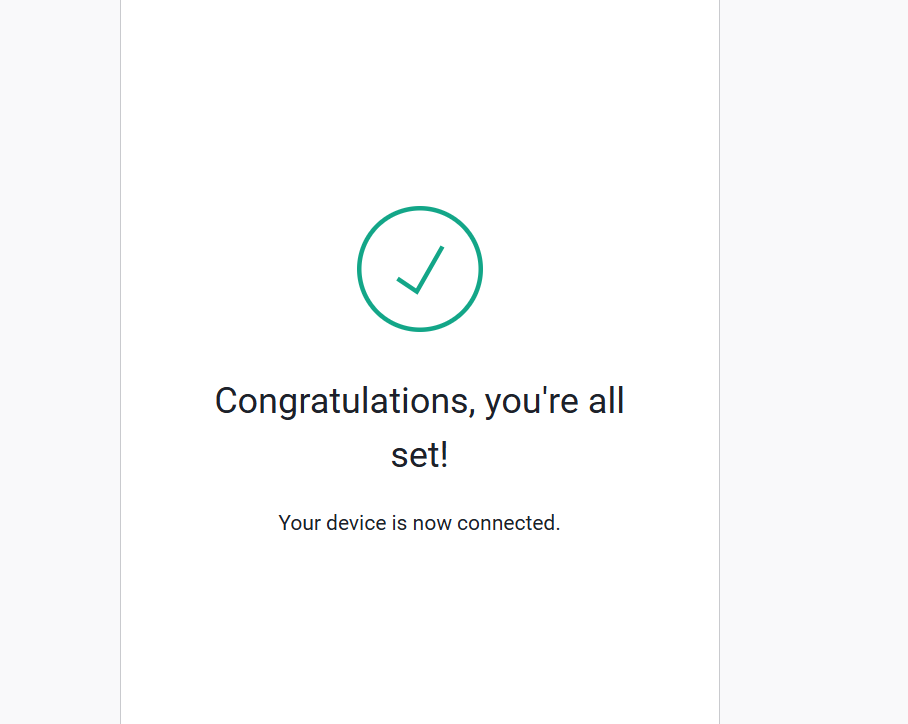

9. Create an image named my-custom-image with the following details: 
a. nginx as the base image using latest tag 
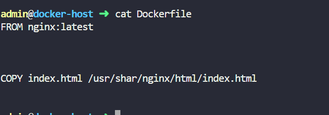

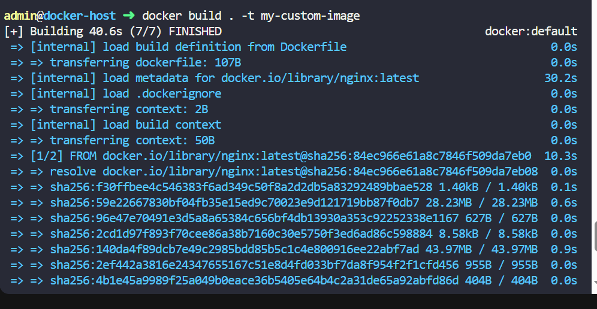

b. Create an index.html and copy it to the nginx directory 

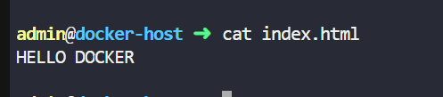
10. Upload your image to your Docker Hub. Verify that you have the image on 
your Docker Hub account 

Sign in with your Docker account
Create an image repository on Docker Hub
Build the container image

build using Dockerfile

Push the image to Docker Hub

sudo docker build . -t villagracia213/samp-images:my-app

sudo docker push villagracia213/samp-images:my-app

Docker Networking 

11. Create a network named docker_net. 

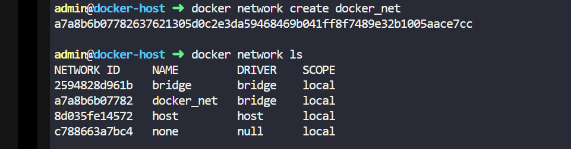

12. Run a nginx container named nginx_on_net. Use latest image 

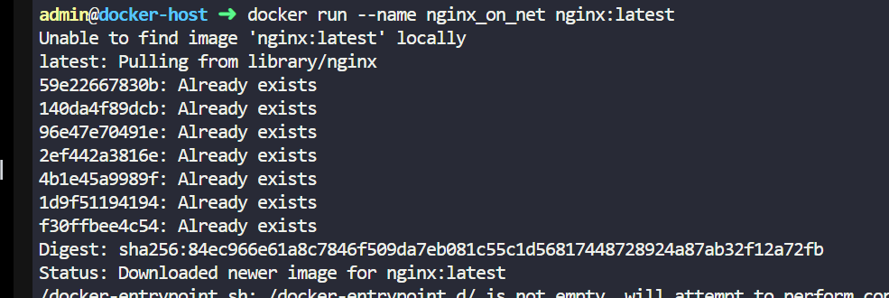

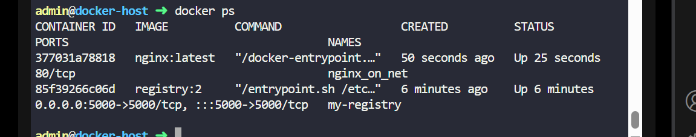

13. Attach the nginx container named nginx3 from Exercise no.7 to the network. 
a. 
View the nginx_3 page from nginx_on_net by using wget 
command: wget or curl 
Make sure to install wget for the command to run
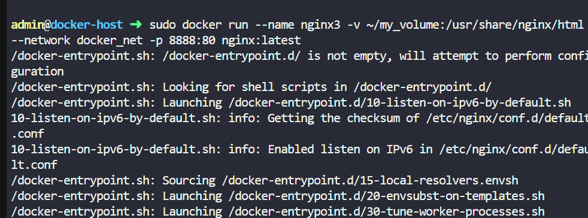

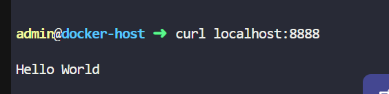

docker inspect nginx3 | grep -i "network"

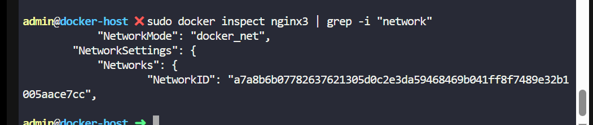

## ADDITIONAL REFERRENCE

CONVERTING CONTAINER INTO IMAGE

sudo docker commit [container ID] [set image tag]

