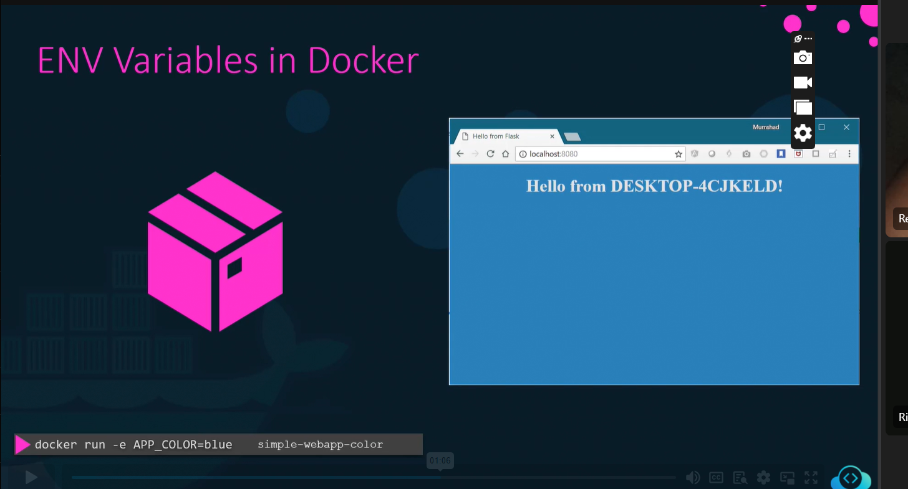

## creating an image from an image / Docker file

FROM python:3.6-alpine

RUN pip install flask

COPY . /opt/

EXPOSE 8080

WORKDIR /opt

ENTRYPOINT ["python", "app.py"]

# run a container with the images created

docker run -d --name web -p 8383:8080 webapp-color:lite

### adding tag for image built

docker build . -t [name]

### Push to docker hub [to make it public]

docker build . -t [accountname]/[tag]

docker login 

docker push [tag]

### adding env variables

## FIND THE VARIABLE using 

docker inspect 

or by running it

## commands vs Entry point

if the webserver is down, the conatiner exits

Dockerfile:
CMD  ["cmd","param1"]
performs the command in the docker build

ENTRYPOINT ["cmd","param1"]

gets the param or the operand when runing 

docker run

almost the same but can be overwrite 

### DOCKER COMPOSE

Docker compose : making yaml files

$ docker-compose up

------------------------------
Create a docker-compose.yml file under the directory /root/clickcounter. Once done, run docker-compose up.

The compose file should have the exact specification as follows -

redis service specification - Image name should be redis:alpine.
clickcounter service specification - Image name should be kodekloud/click-counter, app is run on port 5000 and expose it on the host port 8085 in the compose file

------------------

docker run 

docker run with links
-to connect to each other 

proper way:

version: '3.8'

services:
  redis:
    image: redis:alpine

  clickcounter:
    image: kodekloud/click-counter
    ports:
      - "8085:5000"

### Archiving the imahe

docker save -o [image]

loading the images:

  