Create a ReplicaSet using the replicaset-definition-1.yaml file located at /root/.


There is an issue with the file, so try to fix it.
-----------------------------------------------------------------------------------

controlplane ~ ✖ kubectl delete rs new-replica-set
replicaset.apps "new-replica-set" deleted

controlplane ~ ➜  kubectl apply -f /root/new-replica-set.yaml
replicaset.apps/new-replica-set created

controlplane ~ ➜  kubectl set image rs/new-replica-set busybox-container=busybox:latest
replicaset.apps/new-replica-set image updated

controlplane ~ ➜  kubectl delete pods -l name=busybox-pod
pod "new-replica-set-6hj26" deleted
pod "new-replica-set-gj2cb" deleted
pod "new-replica-set-pnt8d" deleted
pod "new-replica-set-vjskc" deleted

### Remove the taint on controlplane, which currently has the taint effect of NoSchedule.


Run the command: kubectl taint nodes controlplane node-role.kubernetes.io/control-plane:NoSchedule-


### How many objects are in the prod environment including PODs, ReplicaSets and any other objects?


kubectll get pod all --selector env=prod


## Which node is the POD mosquito on now?

Run the command kubectl get pods -o wide and look at the Node column.


---
Set Node Affinity to the blue deployment to place the pods on node01 only.

Ensure that node01 has the label color=blue.

Requirements:

Use requiredDuringSchedulingIgnoredDuringExecution node affinity
Key: color
Value: blue

If the label is not already set, apply it to node01 before updating the deployment.

``` yaml
apiVersion: apps/v1
kind: Deployment
metadata:
  name: blue
spec:
  replicas: 3
  selector:
    matchLabels:
      run: nginx
  template:
    metadata:
      labels:
        run: nginx
    spec:
      containers:
      - image: nginx
        imagePullPolicy: Always
        name: nginx
      affinity:            # affinity rules added from here
        nodeAffinity:
          requiredDuringSchedulingIgnoredDuringExecution:
            nodeSelectorTerms:
            - matchExpressions:
              - key: color
                operator: In
                values:
                - blue

```
### What is the path of the directory holding the static pod definition files?


Run the command ps -aux | grep kubelet and identify the config file - --config=/var/lib/kubelet/config.yaml. Then check in the config file for staticPodPath.


### Create a static pod named static-busybox that uses the busybox image , run in the default namespace and the command sleep 1000

Create a pod definition file in the manifests folder. To do this, run the command:
kubectl run --restart=Never --image=busybox static-busybox --dry-run=client -o yaml --command -- sleep 1000 > /etc/kubernetes/manifests/static-busybox.yaml


### We just created a new static pod named static-greenbox. Find it and delete it.


This question is a bit tricky. But if you use the knowledge you gained in the previous questions in this lab, you should be able to find the answer to it.

First, let's identify the node in which the pod called static-greenbox is created. To do this, run:

```bash
root@controlplane:~# kubectl get pods --all-namespaces -o wide  | grep static-greenbox
default       static-greenbox-node01                 1/1     Running   0          19s     10.244.1.2   node01       <none>           <none>
root@controlplane:~#
From the result of this command, we can see that the pod is running on node01.


Next, SSH to node01 and identify the path configured for static pods in this node.

Important: The path need not be /etc/kubernetes/manifests. Make sure to check the path configured in the kubelet configuration file.
root@controlplane:~# ssh node01 
root@node01:~# ps -ef |  grep /usr/bin/kubelet 
root        4147       1  0 14:05 ?        00:00:00 /usr/bin/kubelet --bootstrap-kubeconfig=/etc/kubernetes/bootstrap-kubelet.conf --kubeconfig=/etc/kubernetes/kubelet.conf --config=/var/lib/kubelet/config.yaml --container-runtime-endpoint=unix:///var/run/containerd/containerd.sock --pod-infra-container-image=registry.k8s.io/pause:3.9
root        4773    4733  0 14:05 pts/0    00:00:00 grep /usr/bin/kubelet

root@node01:~# grep -i staticpod /var/lib/kubelet/config.yaml
staticPodPath: /etc/just-to-mess-with-you

root@node01:~# 
Here the staticPodPath is /etc/just-to-mess-with-you


Navigate to this directory and delete the YAML file:
root@node01:/etc/just-to-mess-with-you# ls
greenbox.yaml
root@node01:/etc/just-to-mess-with-you# rm -rf greenbox.yaml 
root@node01:/etc/just-to-mess-with-you#
wait for 30 seconds.

Exit out of node01 using CTRL + D or type exit. You should return to the controlplane node, Check if the static-greenbox pod has been deleted:
root@controlplane:~# kubectl get pods --all-namespaces -o wide  | grep static-greenbox
root@controlplane:~# 

```


deployment.yaml converted into DaemonSets.yaml

changing the kind 
remove replicaset
removeempty values


### Priority 
by default = 0 


create priority yaml
```yaml
apiVersion: "apps/v1"
kind: priorityClassName
metadata:
  name: high-priority 

```

create pod and add priorityClassName
spec.priorityClassName
### Practice Test Multiple Schedulers


Please create a ConfigMap that the new scheduler will utilize, implementing the concept of ConfigMap as a volume.
A ConfigMap definition file named my-scheduler-configmap.yaml has been provided at the /root/ path. This file will be used to create a ConfigMap with the name my-scheduler-config, utilizing the content from the file located at /root/my-scheduler-config.yaml.


Run the below command to create the configMap:
```bash 
kubectl create -f /root/my-scheduler-configmap.yaml

```

### Configuring Scheduling Profile


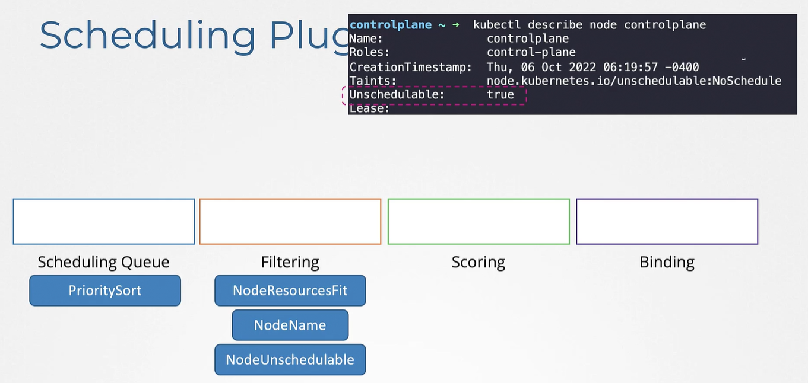

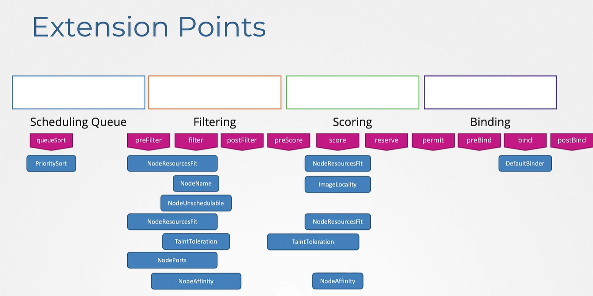


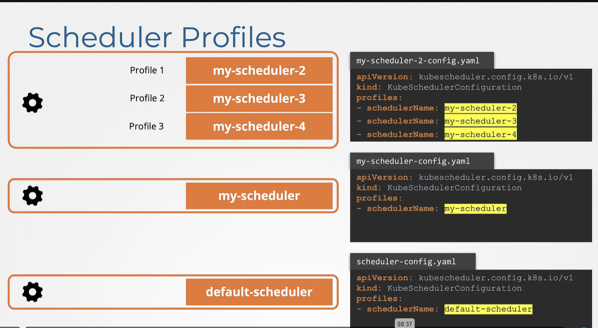


to make scheduler work differently


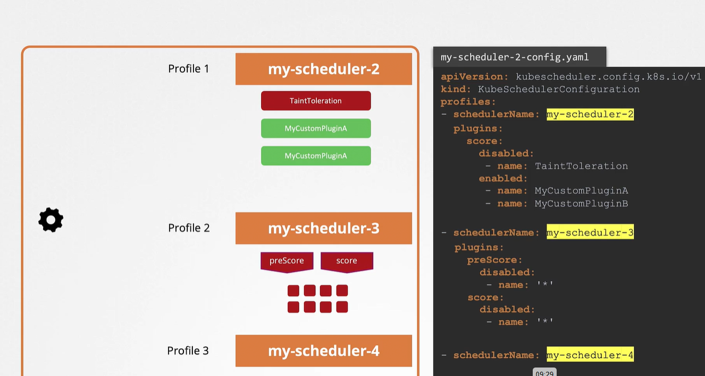

### Monitor server

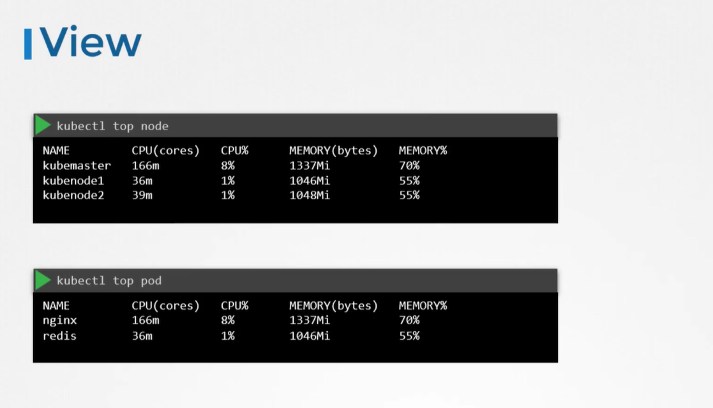


installing metric server:
```bash
 kubectl apply -f https://github.com/kubernetes-sigs/metrics-server/releases/latest/download/components.yaml
```


show the metric 

```bash 

kubectl top nodes

```

### Managing Application Logs


### Rolling Updates and Rollbacks

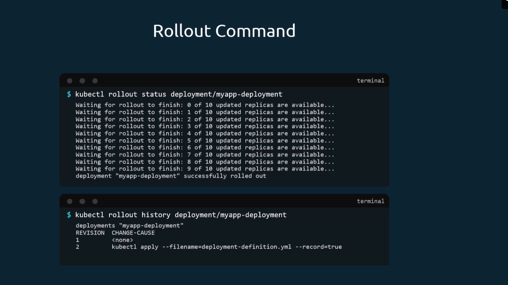


rolling update is the default strategy


### Create ConfigMaps
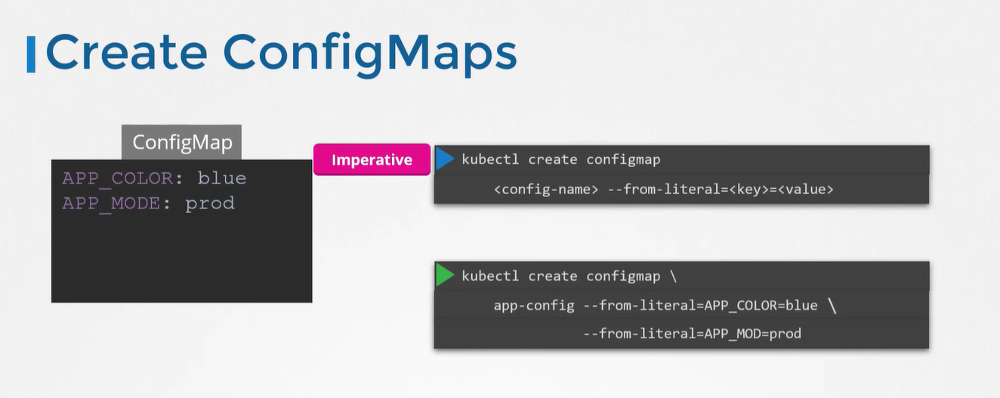
uses the data instead of spec 


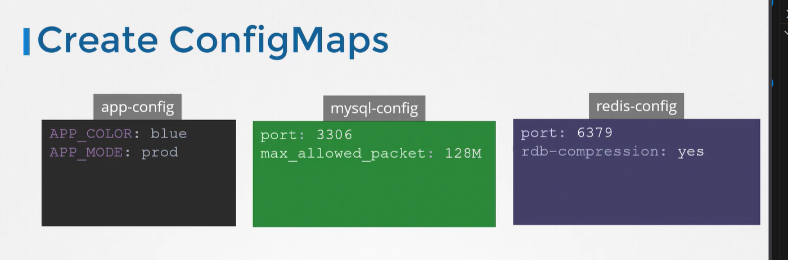

### CREATE secret

step 1: create secret yaml and encode the password


step 2: Configure it for the pod


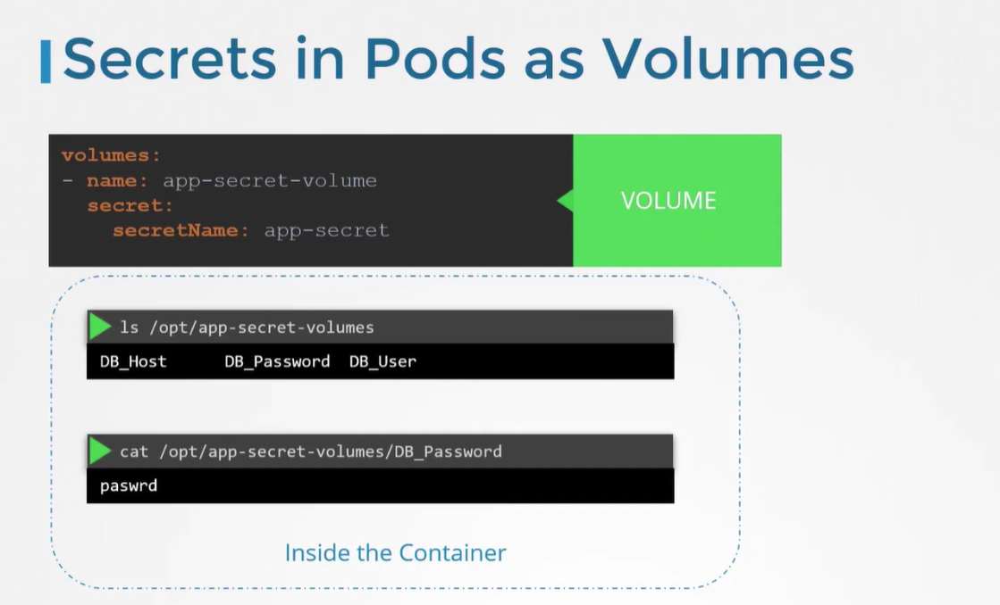


encrypt data at rest

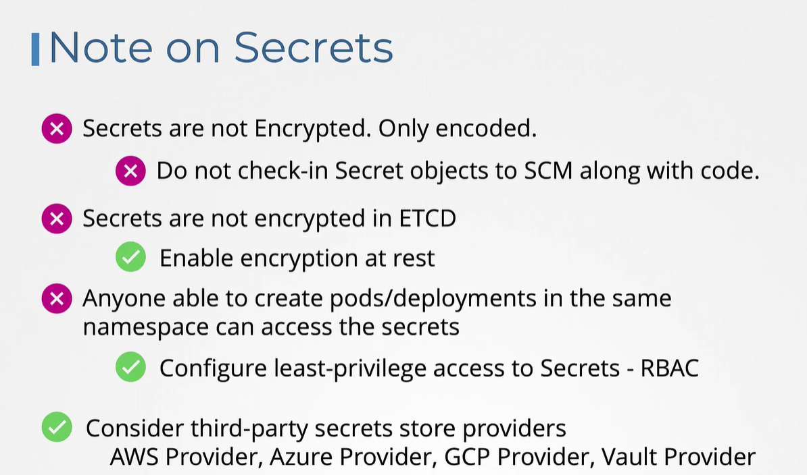


The reason the application is failed is because we have not created the secrets yet. Create a new secret named db-secret with the data given below.


You may follow any one of the methods discussed in lecture to create the secret.


DB_Host = sql01


DB_User = root


DB_Password = password123


Run the command: kubectl create secret generic db-secret --from-literal=DB_Host=sql01 --from-literal=DB_User=root --from-literal=DB_Password=password123

configure by recreating the pod:
enFrom:
  configRef:
    name: secret-name


verification: # list secrets
kubectl get secrets

# show secret as YAML (still base64-encoded)
kubectl get secret my-secret -o yaml

# decode a specific key (example: 'password')
kubectl get secret my-secret -o jsonpath="{.data.password}" | base64 --decode ; echo


ibstall etcd server


### The Nautilus DevOps team is working on to setup some pre-requisites for an application that will send the greetings to different users. There is a sample deployment, that needs to be tested. Below is a scenario which needs to be configured on Kubernetes cluster. Please find below more details about it.


Create a pod named print-envars-greeting.

Configure spec as, the container name should be print-env-container and use bash image.

Create three environment variables:

a. GREETING and its value should be Welcome to

b. COMPANY and its value should be xFusionCorp

c. GROUP and its value should be Industries

Use command ["/bin/sh", "-c", 'echo "$(GREETING) $(COMPANY) $(GROUP)"'] (please use this exact command), also set its restartPolicy policy to Never to avoid crash loop back.

You can check the output using kubectl logs -f print-envars-greeting command.


#### CLUSTER MANAGEMENT

To seamlessly transition from Kubernetes v1.32 to v1.33 and gain access to the packages specific to the desired Kubernetes minor version, follow these essential steps during the upgrade process. This ensures that your environment is appropriately configured and aligned with the features and improvements introduced in Kubernetes v1.33.

On the controlplane node:

Use any text editor you prefer to open the file that defines the Kubernetes apt repository.

vim /etc/apt/sources.list.d/kubernetes.list
Update the version in the URL to the next available minor release, i.e v1.33.

deb [signed-by=/etc/apt/keyrings/kubernetes-apt-keyring.gpg] https://pkgs.k8s.io/core:/stable:/v1.33/deb/ /
After making changes, save the file and exit from your text editor. Proceed with the next instruction.

apt update

apt-cache madison kubeadm
Based on the version information displayed by apt-cache madison, it indicates that for Kubernetes version 1.33.0, the available package version is 1.33.0-1.1. Therefore, to install kubeadm for Kubernetes v1.33.0, use the following command:

apt-get install kubeadm=1.33.0-1.1
Run the following command to upgrade the Kubernetes cluster.

kubeadm upgrade plan v1.33.0

kubeadm upgrade apply v1.33.0
Note that the above steps can take a few minutes to complete.

Now, upgrade the Kubelet version. Also, mark the node (in this case, the "controlplane" node) as schedulable.

apt-get install kubelet=1.33.0-1.1
Run the following commands to refresh the systemd configuration and apply changes to the Kubelet service:

systemctl daemon-reload

systemctl restart kubelet

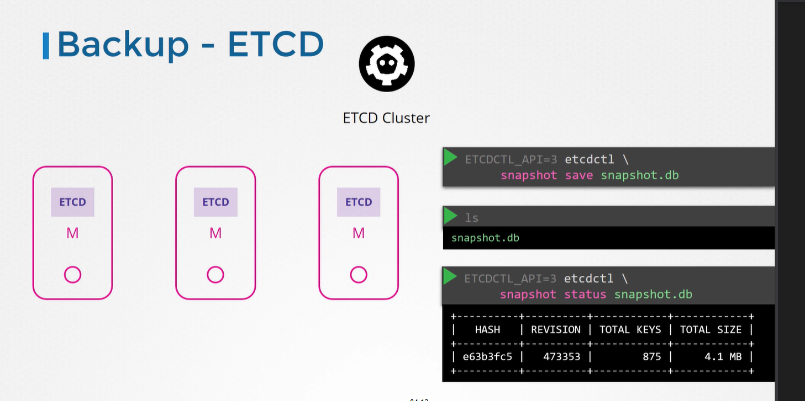

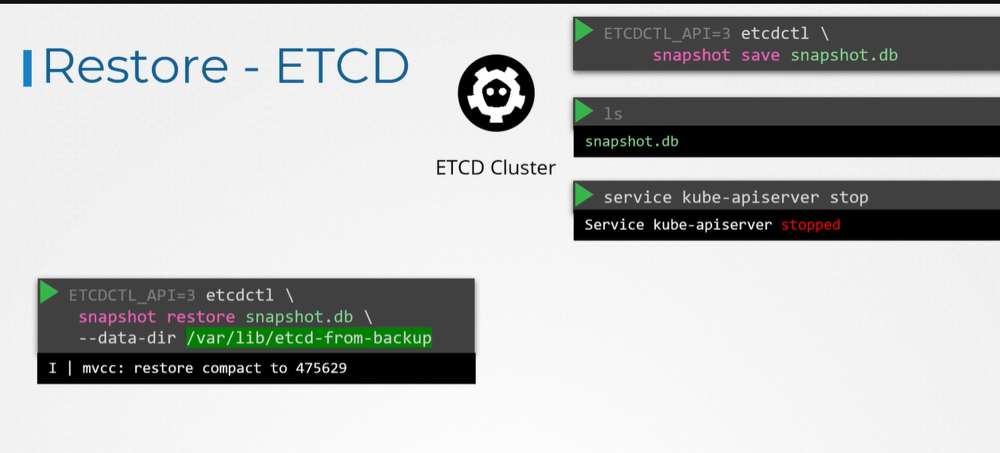


finally


note: 


https://learn.kodekloud.com/user/courses/cka-certification-course-certified-kubernetes-administrator/module/51676566-4860-4564-ad8e-4723a266211e/lesson/dc488b06-cfc5-41d7-81de-ab5c36be31cf