### NETWORKING

    
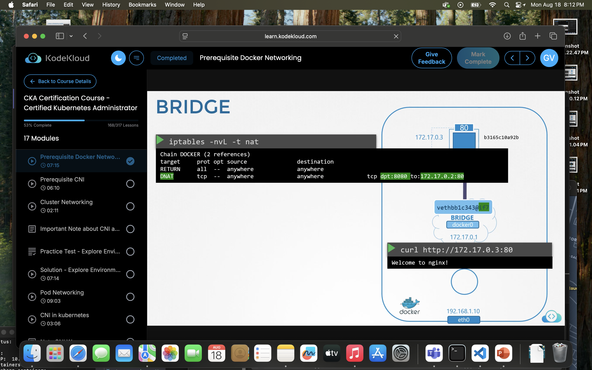


CONTAINER NETWORK INTERFACE 


-programs = plugins


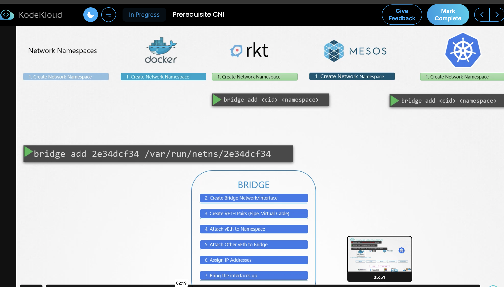


What is the network interface configured for cluster connectivity on the controlplane node?
node-to-node communication


```bash
k get node -o wide 


ip a | grep -B2 192.23.97.3
```


What is the MAC address assigned to node01?

```bash
ssh node01
```

```bash
ip link show eth0
```
If you were to ping google from the controlplane node, which route does it take?
What is the IP address of the Default Gateway?

```bash
ip route show default 
```


What is the port the kube-scheduler is listening on in the controlplane node?
```bash
netstat -ntlup
```

what port has many client connection

netstat -anp | grep 2379 | wc -l

NETWORK MODEL:


connecting nodes


pod network 


CNI 


CNI STANDARD 


Important Update: –

Before going to the CNI weave lecture, we have an update for the Weave Net installation link. They have announced the end of service for Weave Cloud.

To know more about this, read the blog from the link below: –

https://www.weave.works/blog/weave-cloud-end-of-service

As an impact, the old weave net installation link won’t work anymore: –

kubectl apply -f “https://cloud.weave.works/k8s/net?k8s-version=$(kubectl version | base64 | tr -d ‘\n’)”

Instead of that, use the latest link below to install the weave net: –

kubectl apply -f https://github.com/weaveworks/weave/releases/download/v2.8.1/weave-daemonset-k8s.yaml

Reference links: –

https://www.weave.works/docs/net/latest/kubernetes/kube-addon/#-installation
https://github.com/weaveworks/weave/releases


CNI WEAVE 

Inspect the kubelet service and identify the container runtime endpoint value is set for Kubernetes.

```bash
 ps -aux | grep kubelet | grep --color container-runtime-endpoint
```
What is the path configured with all binaries of CNI supported plugins?

ans: /opt/cni/bin


What binary executable file will be run by kubelet after a container and its associated namespace are created?

ans: 
Look at the type field in file /etc/cni/net.d/10-flannel.conflist

### IPAM (IP MANAGEMENT)

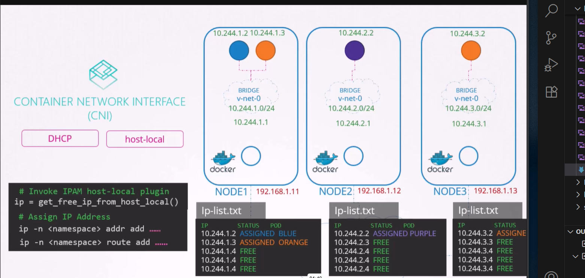

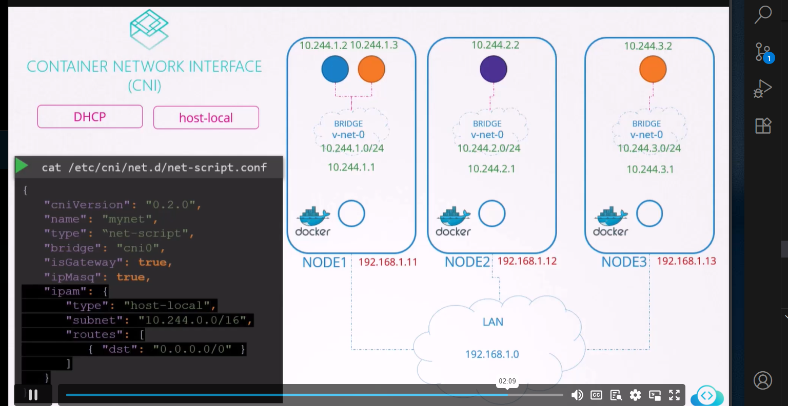


check if the pod access the other 

via :
k exec -it frontend -- curl <ip>


3 / 8
As you have seen, the curl command from the frontend app to the backend app succeeded and returned the NGINX welcome page. However, this should not be the expected behavior given that we have a deny-backend network policy in place to prohibit this from happening.
Why did the curl command succeed?

Refer to the Flannel CNI documentation available at https://github.com/flannel-io/flannel
: flannel CNI doesnt support network policies


The Flannel CNI does not support NetworkPolicies.

Delete Flannel CNI.


flannel is a daemonset
flannel has configmap

``` bash
kubectl delete daemonset -n kube-flannel kube-flannel-ds
kubectl delete cm kube-flannel-cfg -n kube-flannel
rm /etc/cni/net.d/10-flannel.conflist
```

## Service Network

Cluster IP 

- only access within the cluster

NodePort
- accessable outside the cluster

kube-proxy 
- assigns network policies

how they get ip addresses:

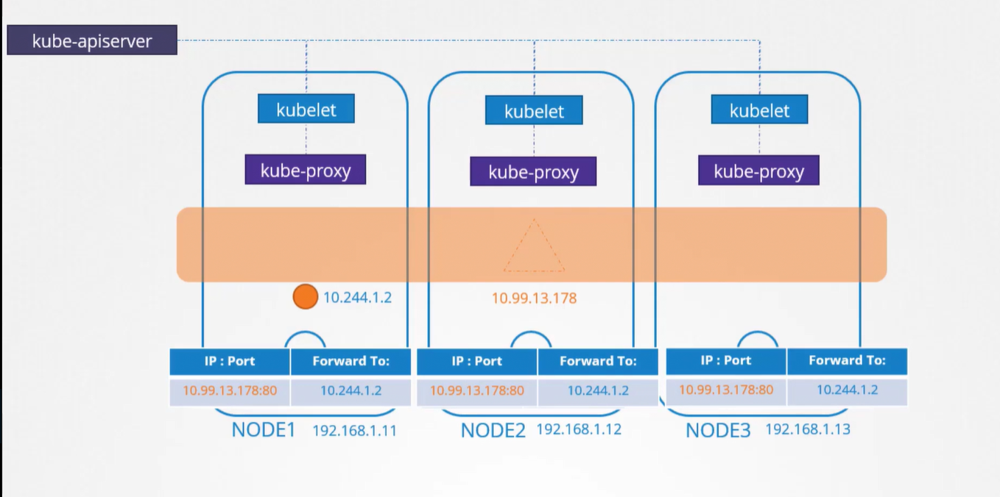

how to make network policies:

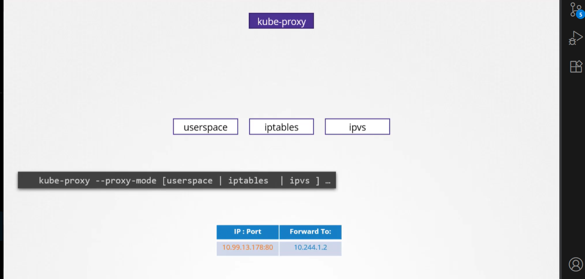


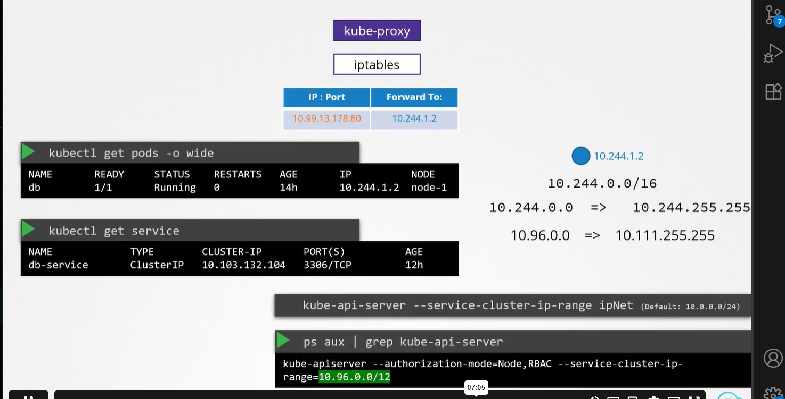

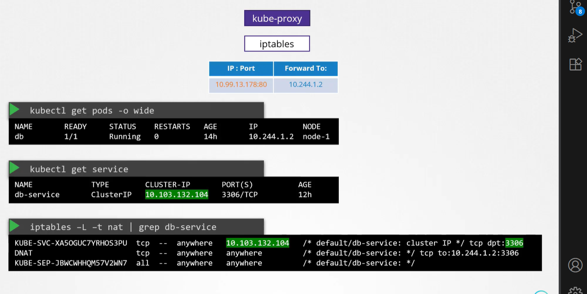


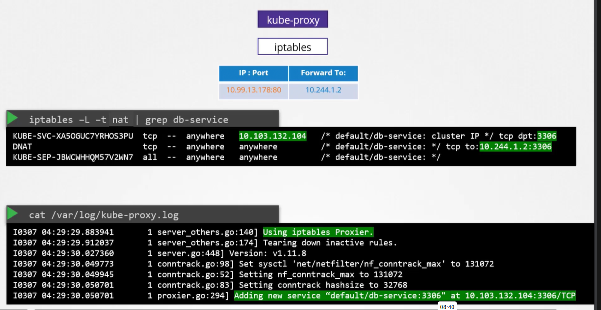


What is the IP address and subnet mask assigned to the controlplane node's primary network interface?
```bash
ip addr show eth0
```

What is the range of IP addresses configured for PODs on this cluster?

```bash
cat /etc/kubernetes/manifests/kube-controller-manager.yaml   | grep cluster-cidr

```

IP-range for the services

```bash
 cat /etc/kubernetes/manifests/kube-apiserver.yaml | grep cluster-ip-range
```
How many kube-proxy pods are deployed in this cluster?
kube-prox=kube-system


```bash
k get pods -n kube-system | grep kube-proxy
```


What type of proxy is the kube-proxy configured to use?


look at the logs, lokfor the type proxy like iptables | flannel :
```bash
k logs kube-proxy-sxejqn
```

How does this Kubernetes cluster ensure that a kube-proxy pod runs on all nodes in the cluster?

Inspect the kube-proxy pods and try to identify how they are deployed.
: using daemonsets

### DNS in CLUSTER

pods and services 


kube dns 

k expose pod <podName> --port=2001

creates subdomains on Namespace 
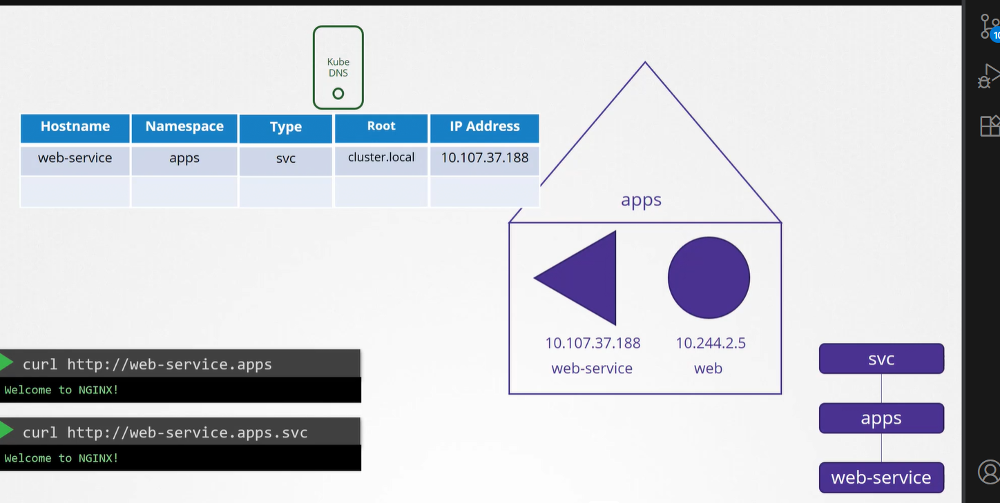
for pods replaces . with -

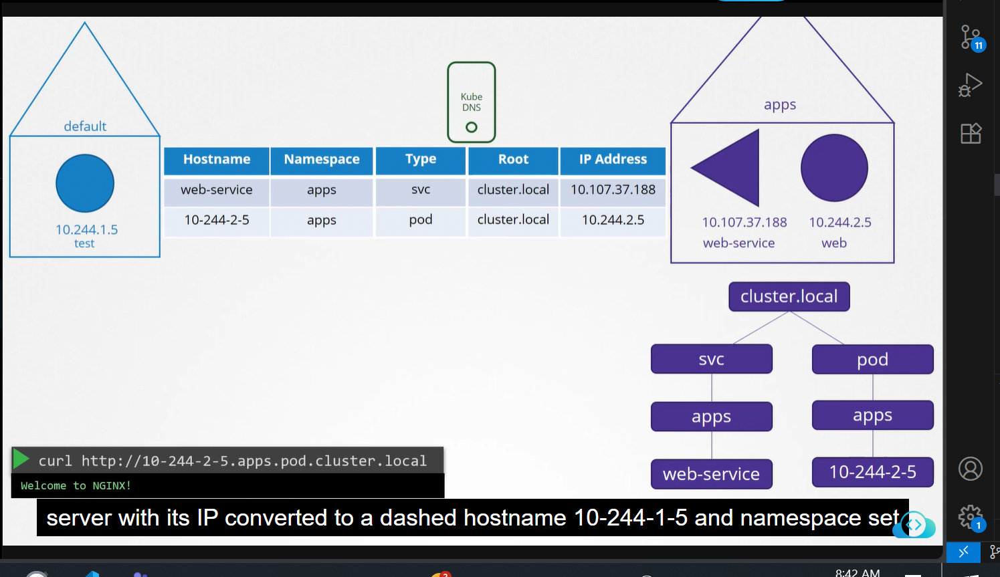

### HOW kubernetes Implements DNS ??

CoreDNS
cat >> /etc/hosts


moved into the centralized DNS

on pods level
cat >> /etc/resolv.conf

In kubernetes 
./Coredns == cat /etc/coredns/Corefile
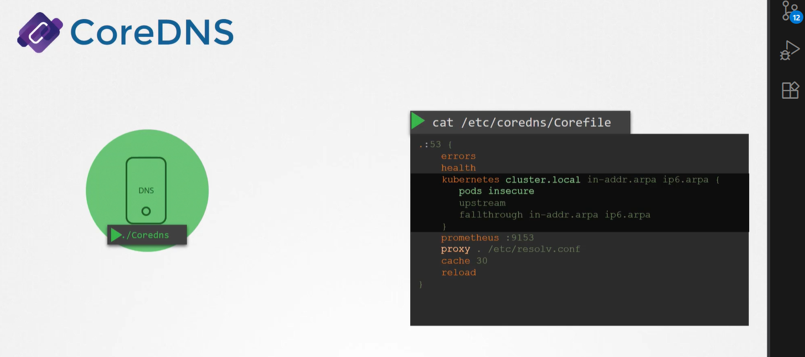


kublet creates the config-file automatically
k get service -n kube-system

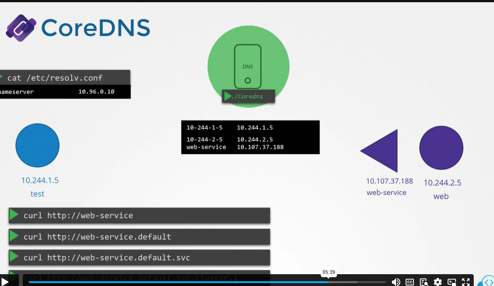

Identify the DNS solution implemented in this cluster.
Run the command: kubectl get pods -n kube-system and look for the DNS pods.


for svc configured in the DNS pods
```bash
k get svc -n kube-system
```
How is the Corefile passed into the CoreDNS POD?
Use the kubectl get configmap command for kube-system namespace and inspect the correct ConfigMap.


Configuring env of env to point to mysql in payroll namespace 

```yaml
env:
- name: DB_HOST
  value: mysql.payroll
```

Executing nslookUp to mysql from hr pod 
```bash
k exec -it -- nslookup mysql.payroll  
```

Where is the configuration file located for configuring the CoreDNS service?
```bash
kubectl -n kube-system describe deployments.apps coredns | grep -A2 Args | grep Corefile
```

How is the Corefile passed into the CoreDNS POD?

configured in configMap


What is the root domain/zone configured for this kubernetes cluster?
```bash

kubectl describe configmap coredns -n kube-system
```
What name can be used to access the hr web server from the test Application?

You can execute a curl command on the test pod to test. Alternatively, the test Application also has a UI. Access it using the tab at the top of your terminal named test-app.

web-service


Which of the names CANNOT be used to access the HR service from the test pod?

web-service.pod


Which of the below name can be used to access the payroll service from the test application?

web-service.payroll


We just deployed a web server - webapp - that accesses a database mysql - server. However the web server is failing to connect to the database server. Troubleshoot and fix the issue.


They could be in different namespaces. First locate the applications. The web server interface can be seen by clicking the tab Web Server at the top of your terminal.

set ENV value to web.payroll

## INGRESS 

1. Deploy supported solution
Ingress Controller 
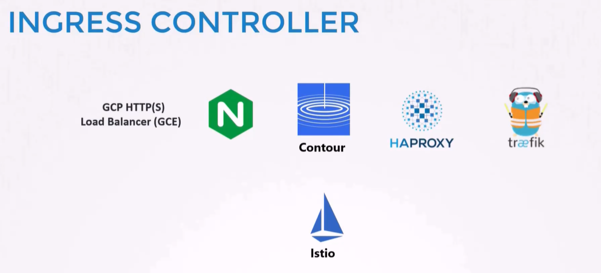

GCP and nginx are the once who are supported

2. Configure 

Ingress Resources

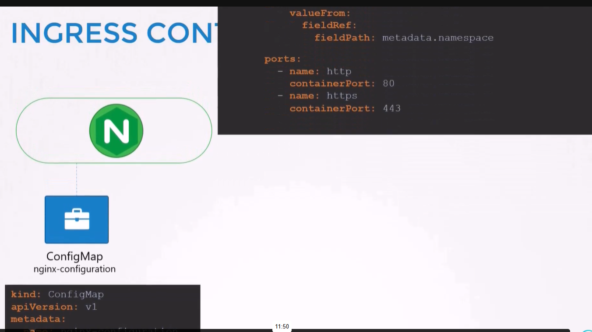

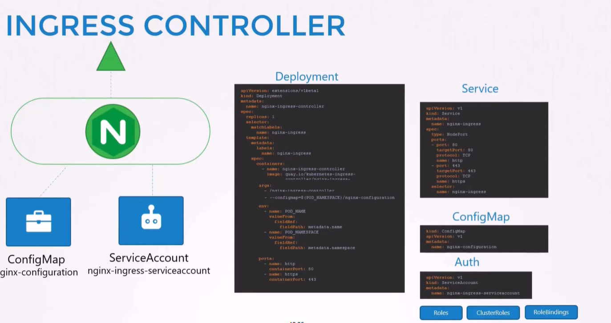

always check the documentation for the ingress

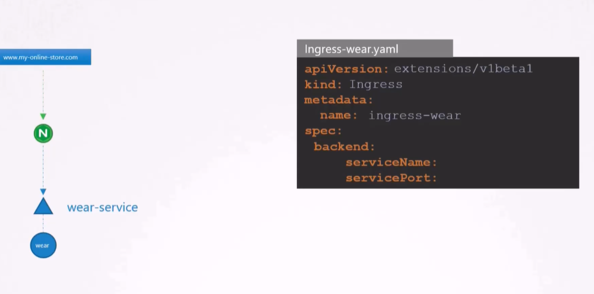

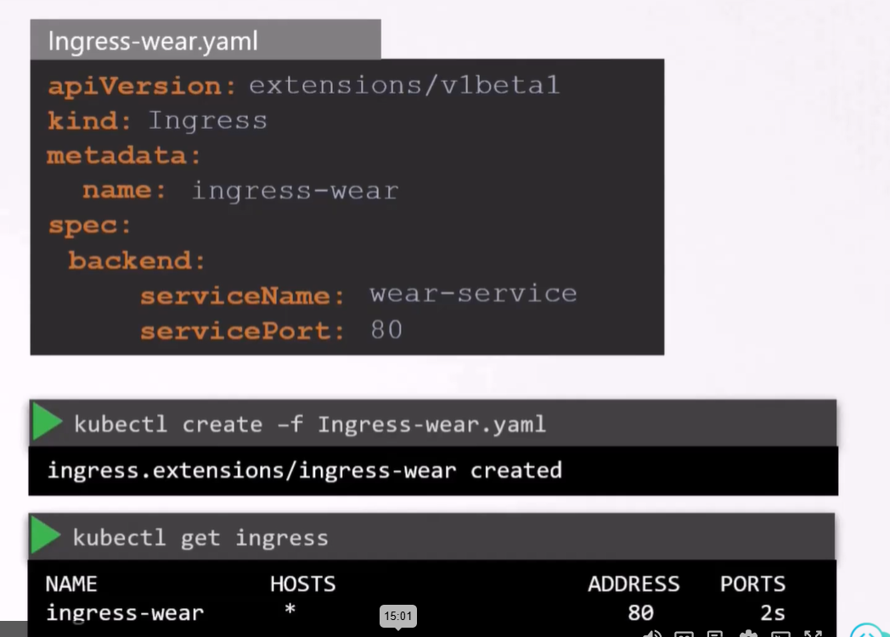

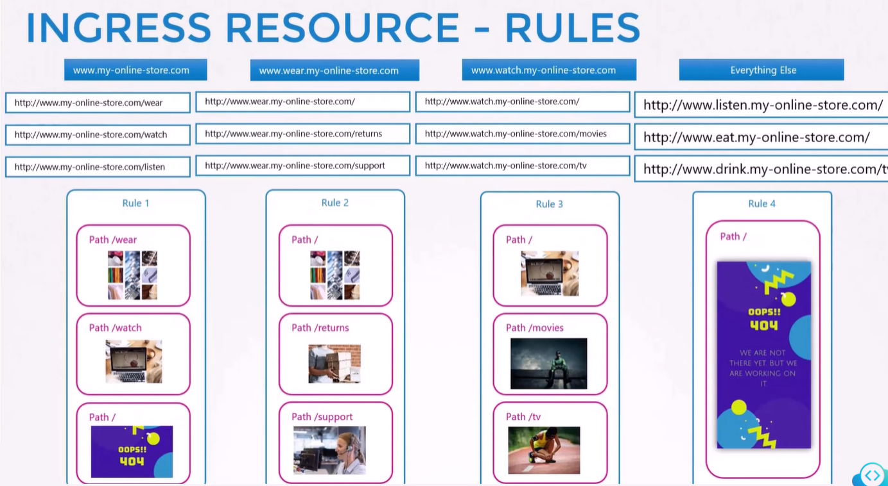

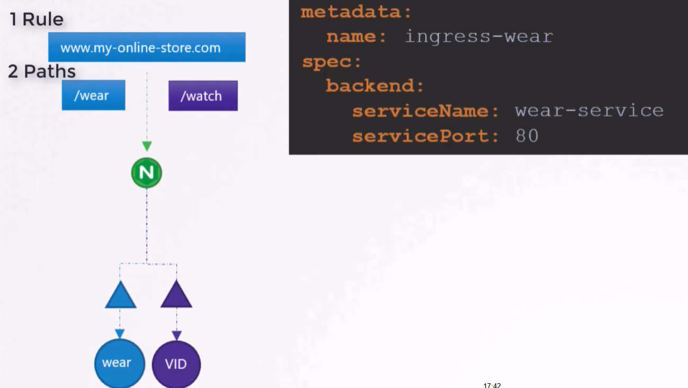


traffic watch:

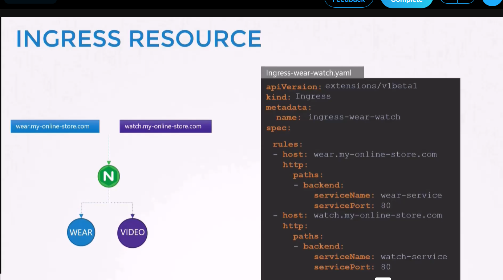

### Imperative :

As we already discussed Ingress in our previous lecture. Here is an update. 

In this article, we will see what changes have been made in previous and current versions in Ingress.

Like in apiVersion, serviceName and servicePort etc.


Now, in k8s version 1.20+, we can create an Ingress resource in the imperative way like this:-

Format -
```bash
 kubectl create ingress  --rule="host/path=service:port"**
```
Example -
```bash
kubectl create ingress ingress-test --rule="wear.my-online-store.com/wear*=wear-service:80"**
```
Find more information and examples in the below reference link:-**

https://kubernetes.io/docs/reference/generated/kubectl/kubectl-commands#-em-ingress-em- 

References:-

https://kubernetes.io/docs/concepts/services-networking/ingress

https://kubernetes.io/docs/concepts/services-networking/ingress/#path-types


### annotations:


Different ingress controllers have different options that can be used to customise the way it works. NGINX Ingress controller has many options that can be seen here. I would like to explain one such option that we will use in our labs. The Rewrite target option.

Our watch app displays the video streaming webpage at http://<watch-service>:<port>/

Our wear app displays the apparel webpage at http://<wear-service>:<port>/

We must configure Ingress to achieve the below. When user visits the URL on the left, his/her request should be forwarded internally to the URL on the right. Note that the /watch and /wear URL path are what we configure on the ingress controller so we can forward users to the appropriate application in the backend. The applications don't have this URL/Path configured on them:

http://<ingress-service>:<ingress-port>/watch --> http://<watch-service>:<port>/

http://<ingress-service>:<ingress-port>/wear --> http://<wear-service>:<port>/

Without the rewrite-target option, this is what would happen:

http://<ingress-service>:<ingress-port>/watch --> http://<watch-service>:<port>/watch

http://<ingress-service>:<ingress-port>/wear --> http://<wear-service>:<port>/wear

Notice watch and wear at the end of the target URLs. The target applications are not configured with /watch or /wear paths. They are different applications built specifically for their purpose, so they don't expect /watch or /wear in the URLs. And as such the requests would fail and throw a 404 not found error.

To fix that we want to "ReWrite" the URL when the request is passed on to the watch or wear applications. We don't want to pass in the same path that user typed in. So we specify the rewrite-target option. This rewrites the URL by replacing whatever is under rules->http->paths->path which happens to be /pay in this case with the value in rewrite-target. This works just like a search and replace function.

For example: replace(path, rewrite-target)

In our case: replace("/path","/")
```yaml
apiVersion: networking.k8s.io/v1
kind: Ingress
metadata:
  name: test-ingress
  namespace: critical-space
  annotations:
    nginx.ingress.kubernetes.io/rewrite-target: /
spec:
  rules:
    - http:
        paths:
          - path: /pay
            pathType: Prefix
            backend:
              service:
                name: pay-service
                port:
                  number: 8282
```
In another example given here, this could also be:

replace("/something(/|$)(.*)", "/$2")
```yaml
apiVersion: networking.k8s.io/v1
kind: Ingress
metadata:
  name: rewrite
  namespace: default
  annotations:
    nginx.ingress.kubernetes.io/rewrite-target: /$2
spec:
  rules:
    - host: rewrite.bar.com
      http:
        paths:
          - path: /something(/|$)(.*)
            pathType: Prefix
            backend:
              service:
                name: http-svc
                port:
                  number: 80
```
Finding  Ingress Resource 

```bash 
k get ingress -A 
```

Rules configured host:
* : means all host


What backend is the /wear path on the Ingress configured with?

Rules:
  Host        Path  Backends
  ----        ----  --------
  *           
              /wear    wear-service:8080 (172.17.0.4:8080)
              /watch   video-service:8080 (172.17.0.5:8080)
Annotations:  nginx.ingress.kubernetes.io/rewrite-target: /
              nginx.ingress.kubernetes.io/ssl-redirect: false


----------------------------------------------------------------------------------------------


If the requirement does not match any of the configured paths in the Ingress, to which service are the requests forwarded?


Execute the command kubectl describe ingress --namespace app-space and examine the Default backend field. If it displays <default>, proceed to inspect the ingress controller's manifest by executing kubectl get deploy ingress-nginx-controller -n ingress-nginx -o yaml. In the manifest, search for the argument --default-backend-service

```bash
kubectl get deployment ingress-nginx-controller -n ingress-nginx -o yaml | grep -i "backend"
```
If the requirement does not match any of the configured paths in the Ingress, to which service are the requests forwarded?

k get deployment ingress-nginx-controller -n ingress-nginx   -o yaml | grep "backend"


You are requested to create the ingress name as critical-ingress to make the new application available at /pay.


Identify and implement the best approach to making this application available on the ingress controller and test to make sure its working.

Look into annotations: rewrite-target as well.

Ingress Created

Path: /pay

Configure correct backend service

Configure correct backend port

Has the rewrite-target annotation been added?

Is the application accessible at the /pay?
```bash

k create ingress critical-ingress -n critical-space --rule="/pay=pay-service:8282" --annotation="nginx.ingress.kubernetes.io/rewrite-target=/$2" --class=nginx 
```
The NGINX Ingress Controller requires two ServiceAccounts. Create both ServiceAccount with name ingress-nginx and ingress-nginx-admission in the ingress-nginx namespace.


Use the spec provided below.

Name: ingress-nginx
Name: ingress-nginx-admission

Run the below commands: 
```bash
kubectl create serviceaccount ingress-nginx --namespace ingress-nginx and
kubectl create serviceaccount ingress-nginx-admission --namespace ingress-nginx
```

Create the ingress resource to make the applications available at /wear and /watch on the Ingress service.

Also, make use of rewrite-target annotation field: -

nginx.ingress.kubernetes.io/rewrite-target: /


Ingress resource comes under the namespace scoped, so don't forget to create the ingress in the app-space namespace.
```yaml
---
apiVersion: networking.k8s.io/v1
kind: Ingress
metadata:
  name: ingress-wear-watch
  namespace: app-space
  annotations:
    nginx.ingress.kubernetes.io/rewrite-target: /
    nginx.ingress.kubernetes.io/ssl-redirect: "false"
spec:
  rules:
  - http:
      paths:
      - path: /wear
        pathType: Prefix
        backend:
          service:
           name: wear-service
           port: 
            number: 8080
      - path: /watch
        pathType: Prefix
        backend:
          service:
           name: video-service
           port:
            number: 8080
```


```bash
k create ingress ingress-wear \
> -n app-space
> --rule="/wear=wear-service:8080"
> --rule="/watch=video-service:8080"

```
and then turn the 2nd rule to false


To know the Network configured in the cluster you should count the identical pods . If more than 1 


What is the IP Range configured for the services within the cluster?
```bash
cat /etc/kubernetes/manifests/kube-apiserver.yaml   | grep cluster-ip-range

```

-------------------------------------------------------------------------------------------------

Let us now deploy an Ingress Controller. First, create a namespace called ingress-nginx.


We will isolate all ingress related objects into its own namespace.

Run the command: kubectl create namespace ingress-nginx

nginx-controller should have a namespace , configMaps and service accounts


The NGINX Ingress Controller requires a ConfigMap object. Create a ConfigMap object with name ingress-nginx-controller in the ingress-nginx namespace.


No data needs to be configured in the ConfigMap.

6 / 8
Let us now deploy the Ingress Controller. Create the Kubernetes objects using the given file.


The Deployment and it's service configuration is given at /root/ingress-controller.yaml. There are several issues with it. Try to fix them.


1. deployment 
2. expose to a service 
3. set the ingress