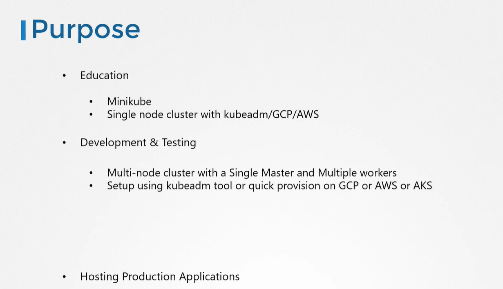
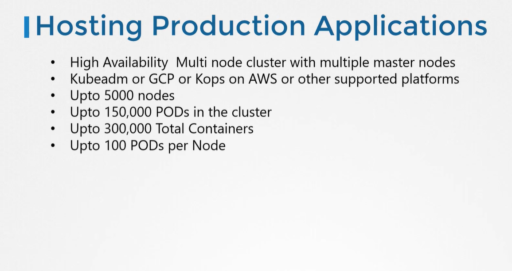
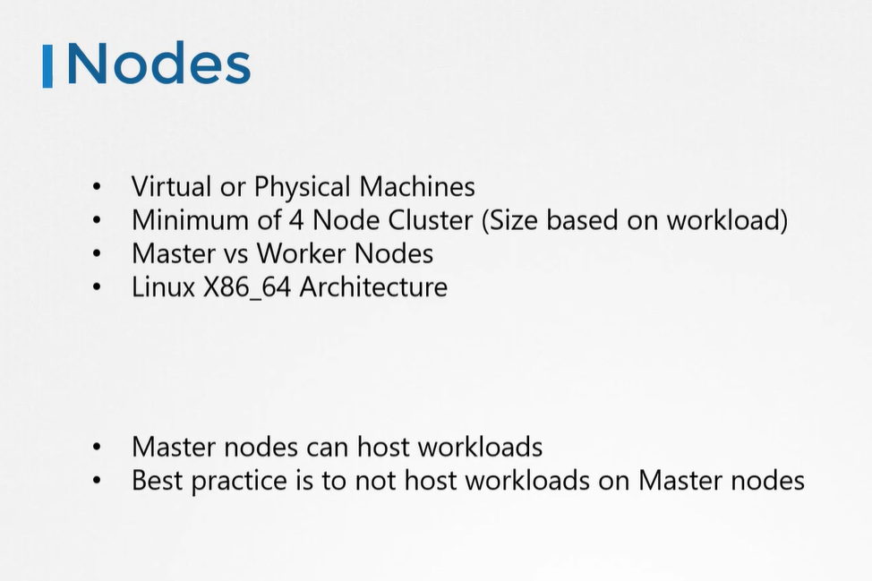
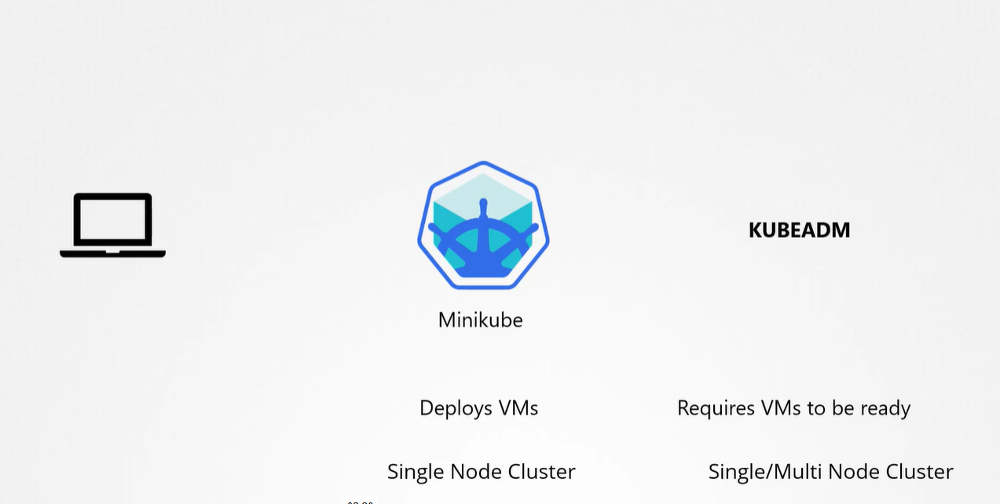
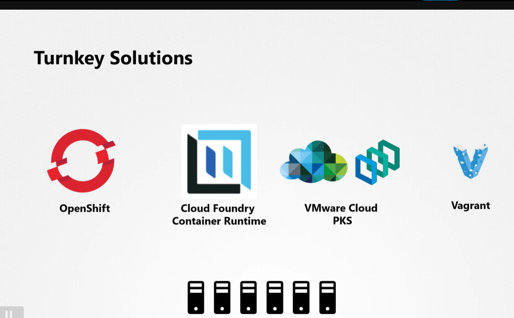
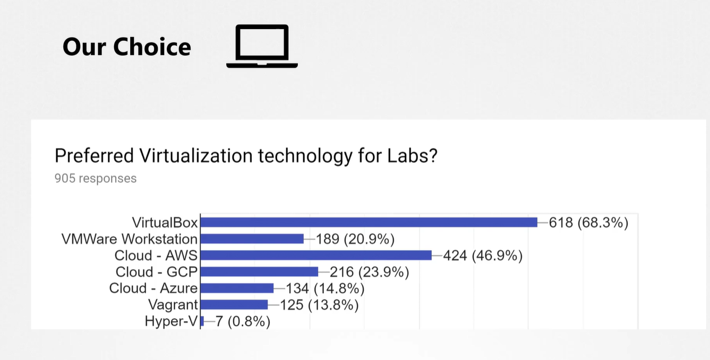
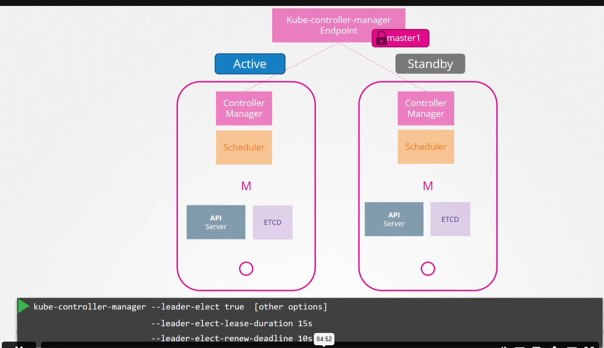
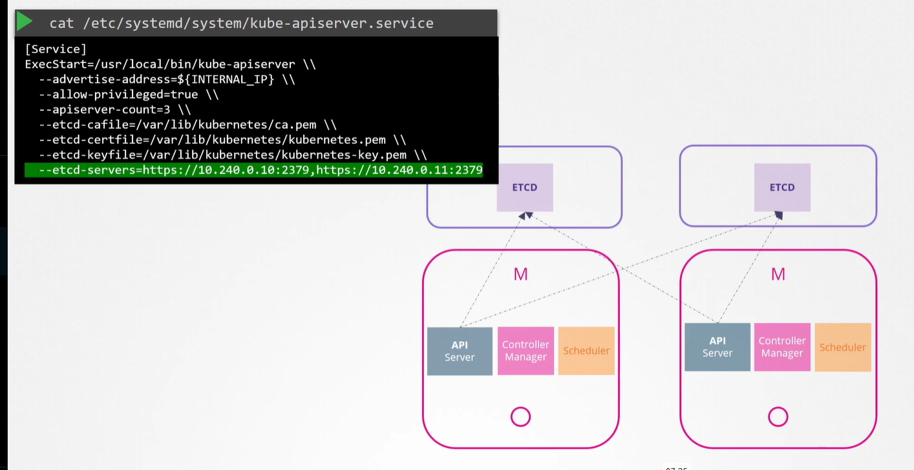

### Configure High Availability

Installing Kubernetes the hard way can help you gain a better understanding of putting together the different components manually.

An optional series on this is available on our YouTube channel here:

https://www.youtube.com/watch?v=uUupRagM7m0&list=PL2We04F3Y_41jYdadX55fdJplDvgNGENo

The GIT Repo for this tutorial can be found here: https://github.com/mmumshad/kubernetes-the-hard-way