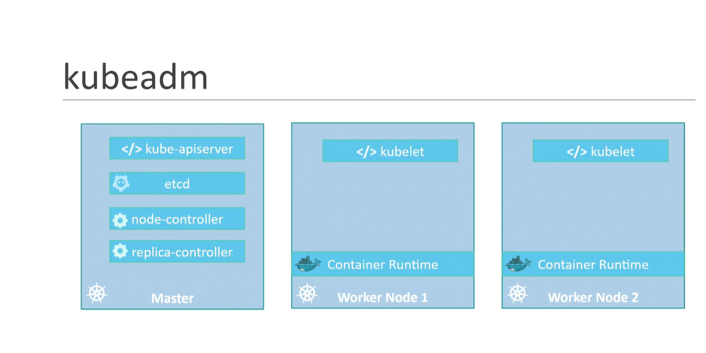
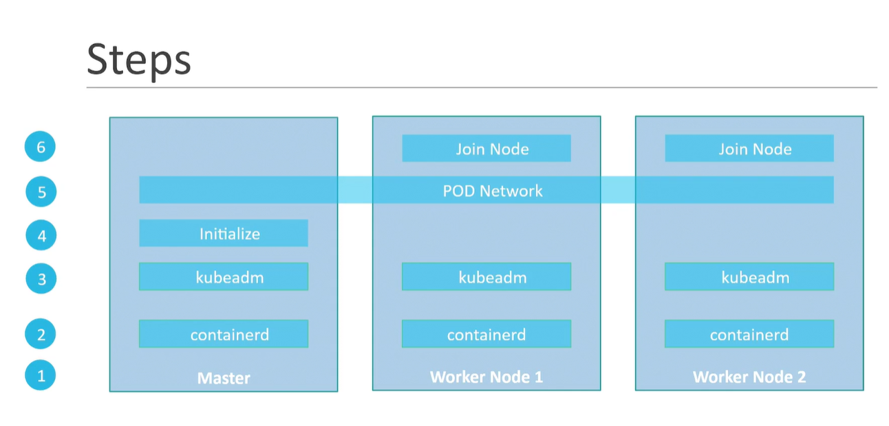

The vagrant file used in the next video is available here:

https://github.com/kodekloudhub/certified-kubernetes-administrator-course

Here’s the link to the documentation:

https://kubernetes.io/docs/setup/production-environment/tools/kubeadm/install-kubeadm/

----------------------------------------------------------------------------------------------------------

Install the kubeadm and kubelet packages on the controlplane and node01 nodes.
Use the exact version of 1.33.0-1.1 for both.


These steps have to be performed on both nodes.

set net.bridge.bridge-nf-call-iptables to 1:

```bash
cat <<EOF | sudo tee /etc/modules-load.d/k8s.conf
br_netfilter
EOF

cat <<EOF | sudo tee /etc/sysctl.d/k8s.conf
net.bridge.bridge-nf-call-ip6tables = 1
net.bridge.bridge-nf-call-iptables = 1
EOF

sudo sysctl --system
```

The container runtime has already been installed on both nodes, so you may skip this step.
Install kubeadm, kubectl and kubelet on all nodes:

pre-request:
```bash
sudo dnf clean all
sudo dnf makecache

```
```bash
sudo apt-get update

sudo apt-get install -y apt-transport-https ca-certificates curl

curl -fsSL https://pkgs.k8s.io/core:/stable:/v1.33/deb/Release.key | sudo gpg --dearmor -o /etc/apt/keyrings/kubernetes-apt-keyring.gpg

echo 'deb [signed-by=/etc/apt/keyrings/kubernetes-apt-keyring.gpg] https://pkgs.k8s.io/core:/stable:/v1.33/deb/ /' | sudo tee /etc/apt/sources.list.d/kubernetes.list

sudo apt-get update

# To see the new version labels
sudo apt-cache madison kubeadm

sudo apt-get install -y kubelet=1.33.0-1.1 kubeadm=1.33.0-1.1 kubectl=1.33.0-1.1

sudo apt-mark hold kubelet kubeadm kubectl
```

## boostrap using kubeadm

Initialize Control Plane Node (Master Node). Use the following options:


apiserver-advertise-address - Use the IP address allocated to eth0 on the controlplane node

apiserver-cert-extra-sans - Set it to controlplane

pod-network-cidr - Set to 172.17.0.0/16

service-cidr - Set to 172.20.0.0/16

Once done, set up the default kubeconfig file and wait for node to be part of the cluster.

### You can use the below kubeadm init command to spin up the cluster:

```bash
IP_ADDR=$(ip addr show eth0 | grep -oP '(?<=inet\s)\d+(\.\d+){3}')
kubeadm init --apiserver-cert-extra-sans=controlplane --apiserver-advertise-address $IP_ADDR --pod-network-cidr=172.17.0.0/16 --service-cidr=172.20.0.0/16
```
Once you run the init command, you should see an output similar to below:


```bash

[init] Using Kubernetes version: v1.33.1
[preflight] Running pre-flight checks
        [WARNING SystemVerification]: cgroups v1 support is in maintenance mode, please migrate to cgroups v2
[preflight] Pulling images required for setting up a Kubernetes cluster
[preflight] This might take a minute or two, depending on the speed of your internet connection
[preflight] You can also perform this action beforehand using 'kubeadm config images pull'
W0520 03:05:34.890872   11137 checks.go:846] detected that the sandbox image "registry.k8s.io/pause:3.6" of the container runtime is inconsistent with that used by kubeadm.It is recommended to use "registry.k8s.io/pause:3.10" as the CRI sandbox image.
[certs] Using certificateDir folder "/etc/kubernetes/pki"
[certs] Generating "ca" certificate and key
[certs] Generating "apiserver" certificate and key
[certs] apiserver serving cert is signed for DNS names [controlplane kubernetes kubernetes.default kubernetes.default.svc kubernetes.default.svc.cluster.local] and IPs [172.20.0.1 192.168.9.95]
[certs] Generating "apiserver-kubelet-client" certificate and key
[certs] Generating "front-proxy-ca" certificate and key
[certs] Generating "front-proxy-client" certificate and key
[certs] Generating "etcd/ca" certificate and key
[certs] Generating "etcd/server" certificate and key
[certs] etcd/server serving cert is signed for DNS names [controlplane localhost] and IPs [192.168.9.95 127.0.0.1 ::1]
[certs] Generating "etcd/peer" certificate and key
[certs] etcd/peer serving cert is signed for DNS names [controlplane localhost] and IPs [192.168.9.95 127.0.0.1 ::1]
[certs] Generating "etcd/healthcheck-client" certificate and key
[certs] Generating "apiserver-etcd-client" certificate and key
[certs] Generating "sa" key and public key
[kubeconfig] Using kubeconfig folder "/etc/kubernetes"
[kubeconfig] Writing "admin.conf" kubeconfig file
[kubeconfig] Writing "super-admin.conf" kubeconfig file
[kubeconfig] Writing "kubelet.conf" kubeconfig file
[kubeconfig] Writing "controller-manager.conf" kubeconfig file
[kubeconfig] Writing "scheduler.conf" kubeconfig file
[etcd] Creating static Pod manifest for local etcd in "/etc/kubernetes/manifests"
[control-plane] Using manifest folder "/etc/kubernetes/manifests"
[control-plane] Creating static Pod manifest for "kube-apiserver"
[control-plane] Creating static Pod manifest for "kube-controller-manager"
[control-plane] Creating static Pod manifest for "kube-scheduler"
[kubelet-start] Writing kubelet environment file with flags to file "/var/lib/kubelet/kubeadm-flags.env"
[kubelet-start] Writing kubelet configuration to file "/var/lib/kubelet/config.yaml"
[kubelet-start] Starting the kubelet
[wait-control-plane] Waiting for the kubelet to boot up the control plane as static Pods from directory "/etc/kubernetes/manifests"
[kubelet-check] Waiting for a healthy kubelet at http://127.0.0.1:10248/healthz. This can take up to 4m0s
[kubelet-check] The kubelet is healthy after 1.001862161s
[control-plane-check] Waiting for healthy control plane components. This can take up to 4m0s
[control-plane-check] Checking kube-apiserver at https://192.168.9.95:6443/livez
[control-plane-check] Checking kube-controller-manager at https://127.0.0.1:10257/healthz
[control-plane-check] Checking kube-scheduler at https://127.0.0.1:10259/livez
[control-plane-check] kube-scheduler is healthy after 12.743187359s
[control-plane-check] kube-controller-manager is healthy after 17.259346714s
[control-plane-check] kube-apiserver is healthy after 35.501756821s
[upload-config] Storing the configuration used in ConfigMap "kubeadm-config" in the "kube-system" Namespace
[kubelet] Creating a ConfigMap "kubelet-config" in namespace kube-system with the configuration for the kubelets in the cluster
[upload-certs] Skipping phase. Please see --upload-certs
[mark-control-plane] Marking the node controlplane as control-plane by adding the labels: [node-role.kubernetes.io/control-plane node.kubernetes.io/exclude-from-external-load-balancers]
[mark-control-plane] Marking the node controlplane as control-plane by adding the taints [node-role.kubernetes.io/control-plane:NoSchedule]
[bootstrap-token] Using token: 50bd8b.x003t0tq1fzmultg
[bootstrap-token] Configuring bootstrap tokens, cluster-info ConfigMap, RBAC Roles
[bootstrap-token] Configured RBAC rules to allow Node Bootstrap tokens to get nodes
[bootstrap-token] Configured RBAC rules to allow Node Bootstrap tokens to post CSRs in order for nodes to get long term certificate credentials
[bootstrap-token] Configured RBAC rules to allow the csrapprover controller automatically approve CSRs from a Node Bootstrap Token
[bootstrap-token] Configured RBAC rules to allow certificate rotation for all node client certificates in the cluster
[bootstrap-token] Creating the "cluster-info" ConfigMap in the "kube-public" namespace
[kubelet-finalize] Updating "/etc/kubernetes/kubelet.conf" to point to a rotatable kubelet client certificate and key
[addons] Applied essential addon: CoreDNS
[addons] Applied essential addon: kube-proxy
```
------------------------------------------------------------------------------------------------------
Your Kubernetes control-plane has initialized successfully!

To start using your cluster, you need to run the following as a regular user:
```bash

  mkdir -p $HOME/.kube
  sudo cp -i /etc/kubernetes/admin.conf $HOME/.kube/config
  sudo chown $(id -u):$(id -g) $HOME/.kube/config
```
Alternatively, if you are the root user, you can run:

  export KUBECONFIG=/etc/kubernetes/admin.conf

You should now deploy a pod network to the cluster.
Run "kubectl apply -f [podnetwork].yaml" with one of the options listed at:
  https://kubernetes.io/docs/concepts/cluster-administration/addons/

Then you can join any number of worker nodes by running the following on each as root:


``` bash
kubeadm join 192.168.9.95:6443 --token 50bd8b.x003t0tq1fzmultg \
        --discovery-token-ca-cert-hash sha256:70a59cdbfc5f5a3f0d49ca90198525870da1fe6f02def53d80a2c00fcc4bde72
```


```
## Generate a kubeadm join token

## Or copy the one that was generated by kubeadm init command

```bash
kubeadm token create --print-join-command
```

### Join node01 to the cluster using the join token

```bash
kubeadm join 192.168.9.95:6443 --token ag7ei8.n0afe8vwgnredqqq --discovery-token-ca-cert-hash sha256:70a59cdbfc5f5a3f0d49ca90198525870da1fe6f02def53d80a2c00fcc4bde72 
```


To install a network plugin, we will go with Flannel as the default choice. For inter-host communication, we will utilize the eth0 interface and update the Network field accordingly.

Ensure that the Flannel manifest includes the appropriate options for this configuration.


For detailed instructions, refer to the official documentation linked in the upper right corner above the terminal.


 On the controlplane node, run the following set of commands to deploy the network plugin:

1. Download the original YAML file and save it as kube-flannel.yml:

```bash
curl -LO https://raw.githubusercontent.com/flannel-io/flannel/v0.20.2/Documentation/kube-flannel.yml

```


2. Open the kube-flannel.yml file using a text editor.

3. We are using a custom PodCIDR (172.17.0.0/16) instead of the default 10.244.0.0/16 when bootstrapping the Kubernetes cluster. However, the Flannel manifest by default is configured to use 10.244.0.0/16 as its network, which does not align with the specified PodCIDR. To resolve this, we need to update the Network field in the kube-flannel-cfg ConfigMap to match the custom PodCIDR defined during cluster initialization.


```bash
net-conf.json: |
    {
      "Network": "10.244.0.0/16", # Update this to match the custom PodCIDR (in the k describe node)
      "Backend": {
        "Type": "vxlan"
      }

```

4. Locate the args section within the kube-flannel container definition. It should look like this:


```bash
  args:
  - --ip-masq
  - --kube-subnet-mgr
```
5. Add the additional argument ``` - --iface=eth0 ``` to the existing list of arguments.


6. Now apply the modified manifest kube-flannel.yml file using kubectl:
```bash
kubectl apply -f kube-flannel.yml
```
monitor the pod status
```bash
watch kubectl get pods -A
```


```bash

controlplane ~ ➜  kubectl get pods -A
NAMESPACE      NAME                                   READY   STATUS    RESTARTS   AGE
kube-flannel   kube-flannel-ds-gc5kf                  1/1     Running   0          54s
kube-flannel   kube-flannel-ds-mtjd6                  1/1     Running   0          54s
kube-system    coredns-668d6bf9bc-7lf7s               1/1     Running   0          3m31s
kube-system    coredns-668d6bf9bc-jl8t6               1/1     Running   0          3m31s
kube-system    etcd-controlplane                      1/1     Running   0          3m37s
kube-system    kube-apiserver-controlplane            1/1     Running   0          3m37s
kube-system    kube-controller-manager-controlplane   1/1     Running   0          3m37s
kube-system    kube-proxy-t5wrt                       1/1     Running   0          3m31s
kube-system    kube-proxy-trmhs                       1/1     Running   0          3m8s
kube-system    kube-scheduler-controlplane            1/1     Running   0          3m37s


```


After all the pods are in the Ready state, the status of both nodes should now become Ready:

```bash
controlplane ~ ➜  kubectl get nodes 
NAME           STATUS   ROLES           AGE   VERSION 
controlplane   Ready    control-plane   15m   v1.33.0 
node01         Ready    <none>          15m   v1.33.0
```


----isssues might arise in UBUNTU --------------------------
containerD install:
```bash
sudo apt update
sudo apt install -y containerd

# Generate default config
sudo mkdir -p /etc/containerd
containerd config default | sudo tee /etc/containerd/config.toml > /dev/null

# Enable systemd cgroups
sudo sed -i 's/SystemdCgroup = false/SystemdCgroup = true/' /etc/containerd/config.toml

# Restart containerd
sudo systemctl restart containerd
sudo systemctl enable containerd

```

```bash
cat <<EOF | sudo tee /etc/sysctl.d/kubernetes.conf
net.bridge.bridge-nf-call-iptables = 1
net.bridge.bridge-nf-call-ip6tables = 1
net.ipv4.ip_forward = 1
EOF
sudo sysctl --system

```
```bash
sudo swapoff -a
sudo sed -i.bak '/ swap / s/^\(.*\)$/#\1/' /etc/fstab
```


```bash

sudo kubeadm reset -f
sudo rm -rf /etc/kubernetes/*
sudo systemctl restart kubelet


````

IN WORKER NODES:

kubadm join 
________________________________________________


-----------------------------------
### FOR CENTOS
```bash
sudo rm /etc/yum.repos.d/kubernetes.repo 

```


```bash
sudo tee /etc/yum.repos.d/kubernetes.repo <<EOF
[kubernetes]
name=Kubernetes
baseurl=https://pkgs.k8s.io/core:/stable:/v1.33/rpm/
enabled=1
gpgcheck=1
gpgkey=https://pkgs.k8s.io/core:/stable:/v1.33/rpm/repodata/repomd.xml.key
EOF
```


```bash
sudo dnf clean all
sudo dnf makecache

```


```bash
sudo dnf install -y kubelet kubeadm kubectl --disableexcludes=kubernetes
```
```bash
sudo systemctl enable --now kubelet

```


## boostrap using kubeadm

Initialize Control Plane Node (Master Node). Use the following options:


apiserver-advertise-address - Use the IP address allocated to eth0 on the controlplane node

apiserver-cert-extra-sans - Set it to controlplane

pod-network-cidr - Set to 172.17.0.0/16

service-cidr - Set to 172.20.0.0/16

Once done, set up the default kubeconfig file and wait for node to be part of the cluster.

### You can use the below kubeadm init command to spin up the cluster:

```bash
IP_ADDR=$(ip addr show eth0 | grep -oP '(?<=inet\s)\d+(\.\d+){3}')
kubeadm init --apiserver-cert-extra-sans=controlplane --apiserver-advertise-address $IP_ADDR --pod-network-cidr=172.17.0.0/16 --service-cidr=172.20.0.0/16
```


--------------if firewalld issue arise or CPU requirements device needed--------------------------------------


1. failed to create new CRI runtime service: ... unknown service runtime.v1.RuntimeService

```bash
sudo dnf install -y containerd.io

sudo mkdir -p /etc/containerd
sudo containerd config default | sudo tee /etc/containerd/config.toml > /dev/null
sudo sed -i 's/SystemdCgroup = false/SystemdCgroup = true/' /etc/containerd/config.toml

sudo systemctl enable --now containerd

```

2. [WARNING Firewalld]: firewalld is active
sudo firewall-cmd --permanent --add-port=6443/tcp
sudo firewall-cmd --permanent --add-port=10250/tcp
sudo firewall-cmd --reload

3. [WARNING Swap]: swap is supported for cgroup v2 only ...
sudo swapoff -a
sudo sed -i.bak '/\sswap\s/s/^/#/' /etc/fstab


4. [ERROR NumCPU]: the number of available CPUs 1 is less than the required 2
change the cpu settings (applicable if you have the physical server)


5. registry error: 
sudo vi /etc/containerd/config.toml
sandbox_image = "registry.k8s.io/pause:3.10"

sudo systemctl restart containerd


manual pulling (optional): sudo ctr -n k8s.io images pull registry.k8s.io/pause:3.10
                           sudo systemctl restart containerd


check: kubeadm config images list


sudo vi /etc/containerd/config.toml

sandbox_image = "registry.k8s.io/pause:3.10"

run it again :

                       # change the enp03 from ip addr
IP_ADDR=$(ip addr show enp0s3| grep -oP '(?<=inet\s)\d+(\.\d+){3}')
kubeadm init --apiserver-cert-extra-sans=controlplane --apiserver-advertise-address $IP_ADDR --pod-network-cidr=172.17.0.0/16 --service-cidr=172.20.0.0/16
--------------------------------------------------------------------


Your Kubernetes control-plane has initialized successfully!

To start using your cluster, you need to run the following as a regular user:
```bash

  mkdir -p $HOME/.kube
  sudo cp -i /etc/kubernetes/admin.conf $HOME/.kube/config
  sudo chown $(id -u):$(id -g) $HOME/.kube/config
```

## pod Network installation

To install a network plugin, we will go with Flannel as the default choice. For inter-host communication, we will utilize the eth0 interface and update the Network field accordingly.

Ensure that the Flannel manifest includes the appropriate options for this configuration.


For detailed instructions, refer to the official documentation linked in the upper right corner above the terminal.


 On the controlplane node, run the following set of commands to deploy the network plugin:

1. Download the original YAML file and save it as kube-flannel.yml:

```bash
curl -LO https://raw.githubusercontent.com/flannel-io/flannel/v0.20.2/Documentation/kube-flannel.yml

```


2. Open the kube-flannel.yml file using a text editor.

3. We are using a custom PodCIDR (172.17.0.0/16) instead of the default 10.244.0.0/16 when bootstrapping the Kubernetes cluster. However, the Flannel manifest by default is configured to use 10.244.0.0/16 as its network, which does not align with the specified PodCIDR. To resolve this, we need to update the Network field in the kube-flannel-cfg ConfigMap to match the custom PodCIDR defined during cluster initialization.


```bash
net-conf.json: |
    {
      "Network": "10.244.0.0/16", # Update this to match the custom PodCIDR (in the k describe node)
      "Backend": {
        "Type": "vxlan"
      }

```

4. Locate the args section within the kube-flannel container definition. It should look like this:


```bash
  args:
  - --ip-masq
  - --kube-subnet-mgr
```
5. Add the additional argument ```bash - --iface=eth0 ``` to the existing list of arguments.


6. Now apply the modified manifest kube-flannel.yml file using kubectl:
```bash
kubectl apply -f kube-flannel.yml
```
monitor the pod status
```bash
watch kubectl get pods -A
```

Alternatively, if you are the root user, you can run:

  export KUBECONFIG=/etc/kubernetes/admin.conf

You should now deploy a pod network to the cluster.
Run "kubectl apply -f [podnetwork].yaml" with one of the options listed at:
  https://kubernetes.io/docs/concepts/cluster-administration/addons/

Then you can join any number of worker nodes by running the following on each as root:


``` bash
kubeadm join 192.168.9.95:6443 --token 50bd8b.x003t0tq1fzmultg \
        --discovery-token-ca-cert-hash sha256:70a59cdbfc5f5a3f0d49ca90198525870da1fe6f02def53d80a2c00fcc4bde72
```


```
## Generate a kubeadm join token

## Or copy the one that was generated by kubeadm init command

```bash
kubeadm token create --print-join-command
```

### Join node01 to the cluster using the join token

```bash
kubeadm join 192.168.9.95:6443 --token ag7ei8.n0afe8vwgnredqqq --discovery-token-ca-cert-hash sha256:70a59cdbfc5f5a3f0d49ca90198525870da1fe6f02def53d80a2c00fcc4bde72 
```


