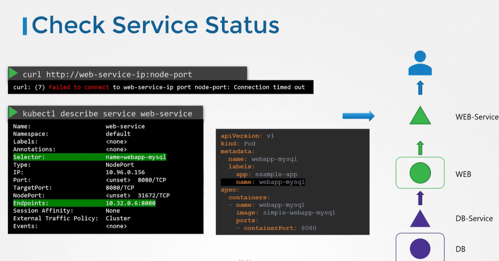
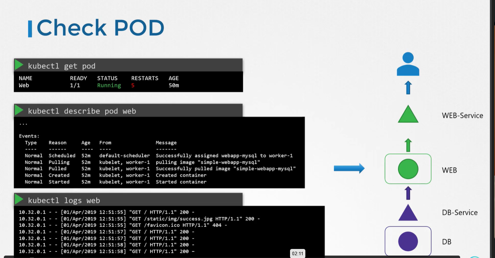
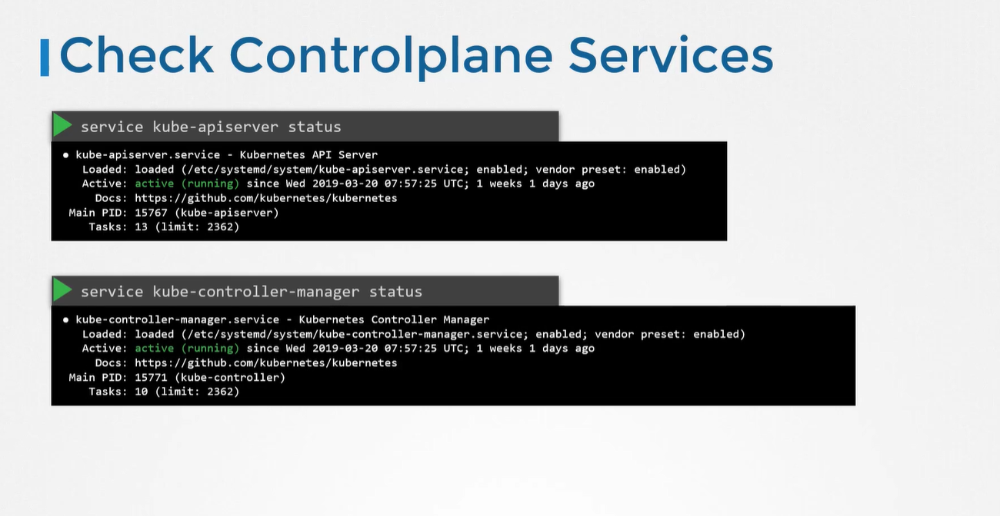
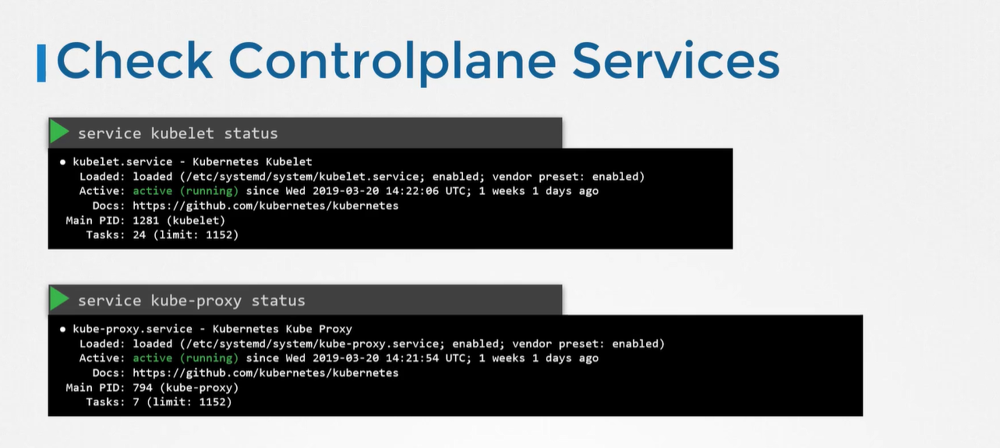
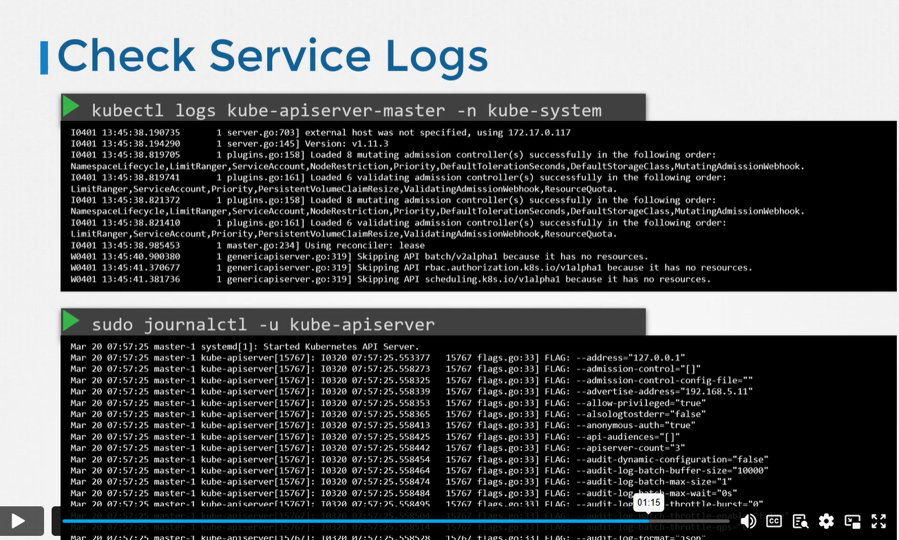

### APLICATION FAILURE

check if the target port is right 

## CONTROL PLANE FAILURE

The cluster is broken. We tried deploying an application but it's not working. Troubleshoot and fix the issue

Run the command: kubectl get pods -n kube-system and check the status of kube-scheduler pod.
We need to check the kube-scheduler manifest file to fix the issue.

The command run by the scheduler pod is incorrect. Here is a snippet of the YAML file.

spec:
  containers:
  - command:
    - kube-scheduler
    - --authentication-kubeconfig=/etc/kubernetes/scheduler.conf
    - --authorization-kubeconfig=/etc/kubernetes/scheduler.conf
    - --bind-address=127.0.0.1
    - --kubeconfig=/etc/kubernetes/scheduler.conf
    - --leader-elect=true
    ....
Once this is corrected, the scheduler pod will be recreated.

Even though the deployment was scaled to 2, the number of PODs does not seem to increase. Investigate and fix the issue.

Inspect the component responsible for managing deployments and replicasets.

Run the command: kubectl get po -n kube-system and check the logs of kube-controller-manager pod to know the failure reason by running command: kubectl logs -n kube-system kube-controller-manager-controlplane

Then check the kube-controller-manager configuration file at /etc/kubernetes/manifests/kube-controller-manager.yaml and fix the issue.

root@controlplane:/etc/kubernetes/manifests# kubectl -n kube-system logs kube-controller-manager-controlplane
I0916 13:10:47.059336       1 serving.go:348] Generated self-signed cert in-memory
stat /etc/kubernetes/controller-manager-XXXX.conf: no such file or directory

root@controlplane:/etc/kubernetes/manifests# 
The configuration file specified (/etc/kubernetes/controller-manager-XXXX.conf) does not exist.
Correct the path: /etc/kubernetes/controller-manager.conf

-------------------------------------------
Something is wrong with scaling again. We just tried scaling the deployment to 3 replicas. But it's not happening.

Investigate and fix the issue.

Check the volume mount path in kube-controller-manager manifest file at /etc/kubernetes/manifests.
Just as we did in the previous question, inspect the logs of the kube-controller-manager pod:

root@controlplane:/etc/kubernetes/manifests# kubectl -n kube-system logs kube-controller-manager-controlplane
I0916 13:17:27.452539       1 serving.go:348] Generated self-signed cert in-memory
unable to load client CA provider: open /etc/kubernetes/pki/ca.crt: no such file or directory

root@controlplane:/etc/kubernetes/manifests# 
It appears the path /etc/kubernetes/pki is not mounted from the controlplane to the kube-controller-manager pod. If we inspect the pod manifest file, we can see that the incorrect hostPath is used for the volume:

WRONG:

- hostPath:
      path: /etc/kubernetes/WRONG-PKI-DIRECTORY
      type: DirectoryOrCreate
CORRECT:

- hostPath: 
    path: /etc/kubernetes/pki 
    type: DirectoryOrCreate 
Once the path is corrected, the pod will be recreated and our deployment should eventually scale up to 3 replicas.
# --------------------------------------------------------------------------

Fix the broken cluster

Step1: Check the status of the nodes:

controlplane:~> kubectl get nodes
NAME           STATUS     ROLES           AGE   VERSION
controlplane   Ready      control-plane   19m   v1.27.0
node01         NotReady   <none>          19m   v1.27.0

controlplane:~> 
Step 2: SSH to node01 and check the status of the container runtime (containerd, in this case) and the kubelet service.

root@node01:~> systemctl status containerd
● containerd.service - containerd container runtime
     Loaded: loaded (/lib/systemd/system/containerd.service; enabled; vendor preset: enabled)
     Active: active (running) since Tue 2023-05-30 12:45:03 EDT; 20min ago
       Docs: https://containerd.io
   Main PID: 995 (containerd)
      Tasks: 100
     Memory: 146.8M
     CGroup: /system.slice/containerd.service
             ├─ 995 /usr/bin/containerd

root@node01:~>

root@node01:~> systemctl status kubelet
● kubelet.service - kubelet: The Kubernetes Node Agent
     Loaded: loaded (/lib/systemd/system/kubelet.service; enabled; vendor preset: enabled)
    Drop-In: /etc/systemd/system/kubelet.service.d
             └─10-kubeadm.conf
     Active: inactive (dead) since Tue 2023-05-30 12:47:30 EDT; 18min ago
       Docs: https://kubernetes.io/docs/home/
    Process: 1978 ExecStart=/usr/bin/kubelet $KUBELET_KUBECONFIG_ARGS $KUBELET_CONFIG_ARGS $KUBELET_KUBEADM_ARGS $KUBELET_EXTRA_ARGS (code=exited, status=0/S>
   Main PID: 1978 (code=exited, status=0/SUCCESS)
Since the kubelet is not running, attempt to start it by running the following command:

root@node01:~> systemctl start kubelet

root@node01:~> systemctl status kubelet
● kubelet.service - kubelet: The Kubernetes Node Agent
     Loaded: loaded (/lib/systemd/system/kubelet.service; enabled; vendor preset: enabled)
    Drop-In: /etc/systemd/system/kubelet.service.d
             └─10-kubeadm.conf
     Active: active (running) since Tue 2023-05-30 13:06:47 EDT; 6s ago
       Docs: https://kubernetes.io/docs/home/
   Main PID: 4313 (kubelet)
      Tasks: 15 (limit: 77091)
     Memory: 31.4M
     CGroup: /system.slice/kubelet.service
node01 should go back to ready state now

## -----------------------------------------------------------------------------------
The cluster is broken again. Investigate and fix the issue.

kubelet has stopped running on node01 again. Since this is a systemd managed system, we can check the kubelet log by running journalctl command. Here is a snippet showing the error with kubelet:

root@node01:~# journalctl -u kubelet 
.
.
May 30 13:08:20 node01 kubelet[4554]: E0530 13:08:20.141826    4554 run.go:74] "command failed" err="failed to construct kubelet dependencies: unable to load client CA file /etc/kubernetes/pki/WRONG-CA-FILE.crt: open /etc/kubernetes/pki/WRONG-CA-FILE.crt: no such file or directory"
.
.

There appears to be a mistake path used for the CA certificate in the kubelet configuration.

This can be corrected by updating the file /var/lib/kubelet/config.yaml as follows: -

  x509:
    clientCAFile: /etc/kubernetes/pki/WRONG-CA-FILE.crt

Update the CA certificate file WRONG-CA-FILE.crt to ca.crt.

Once this is fixed, restart the kubelet service, (like we did in the previous question) and node01 should return back to a working state.
### -----------------------------------------------------------------------------------------

Once again the kubelet service has stopped working. Checking the logs, we can see that this time, it is not able to reach the kube-apiserver.

root@node01:~# journalctl -u kubelet 
.
.
.
May 30 13:43:55 node01 kubelet[8858]: E0530 13:43:55.004939    8858 reflector.go:148] vendor/k8s.io/client-go/informers/factory.go:150: Failed to watch *v1.Node: failed to list *v1.Node: Get "https://controlplane:6553/api/v1/nodes?fieldSelector=metadata.name%3Dnode01&limit=500&resourceVersion=0": dial tcp 192.24.132.5:6553: connect: connection refused
.
.
.

As we can clearly see, kubelet is trying to connect to the API server on the controlplane node on port 6553. This is incorrect.
To fix, correct the port on the kubeconfig file used by the kubelet.

apiVersion: v1
clusters:
- cluster:
    certificate-authority-data:
    --REDACTED---
    server: https://controlplane:6443

Restart the kubelet service after this change.

systemctl restart kubelet

---------------NETWORK TROUBLESHOOT

Network Plugin in Kubernetes
——————–

There are several plugins available, and these are some.

1. Weave Net:

To install,

kubectl apply -f
https://github.com/weaveworks/weave/releases/download/v2.8.1/weave-daemonset-k8s.yaml
You can find details about the network plugins in the following documentation :

https://kubernetes.io/docs/concepts/cluster-administration/addons/#networking-and-network-policy

2. Flannel :

To install,

kubectl apply -f https://raw.githubusercontent.com/coreos/flannel/2140ac876ef134e0ed5af15c65e414cf26827915/Documentation/kube-flannel.yml
Note: As of now, flannel does not support Kubernetes network policies.

3. Calico :

To install,

curl https://docs.projectcalico.org/manifests/calico.yaml -O

_Apply the manifest using the following command._

kubectl apply -f calico.yaml
Calico is said to have the most advanced cni network plugin.

Note: If there are multiple CNI configuration files in the directory, the kubelet uses the configuration file that comes first by name in lexicographic order.

DNS in Kubernetes
—————–
Kubernetes uses CoreDNS. CoreDNS is a flexible, extensible DNS server that can serve as the Kubernetes cluster DNS.

Memory and Pods

In large scale Kubernetes clusters, CoreDNS’s memory usage is predominantly affected by the number of Pods and Services in the cluster. Other factors include the size of the filled DNS answer cache and the rate of queries received (QPS) per CoreDNS instance.

Kubernetes resources for coreDNS are:

a service account named coredns,
cluster-roles named coredns and kube-dns
clusterrolebindings named coredns and kube-dns, 
a deployment named coredns,
a configmap named coredns and a
service named kube-dns.
While analyzing the coreDNS deployment, you can see that the Corefile plugin consists of an important configuration, which is defined as a configmap.

Port 53 is used for DNS resolution.

kubernetes cluster.local in-addr.arpa ip6.arpa {
   pods insecure
   fallthrough in-addr.arpa ip6.arpa
   ttl 30
}
This is the backend to k8s for cluster. local and reverse domains.

proxy . /etc/resolv.conf
Forward out of cluster domains directly to right authoritative DNS server.

Troubleshooting issues related to coreDNS
1. If you find CoreDNS pods in a pending state first check that the network plugin is installed.

2. coredns pods have CrashLoopBackOff or Error state

If you have nodes that are running SELinux with an older version of Docker, you might experience a scenario where the coredns pods are not starting. To solve that, you can try one of the following options:

a)Upgrade to a newer version of Docker.

b)Disable SELinux.

c)Modify the coredns deployment to set allowPrivilegeEscalation to true:

kubectl -n kube-system get deployment coredns -o yaml | \ sed 's/allowPrivilegeEscalation: false/allowPrivilegeEscalation: true/g' | \ kubectl apply -f -

d)Another cause for CoreDNS to have CrashLoopBackOff is when a CoreDNS Pod deployed in Kubernetes detects a loop.

There are many ways to work around this issue; some are listed here:

Add the following to your kubelet config yaml: _resolvConf: _ This flag tells kubelet to pass an alternate resolv.conf to Pods. For systems using systemd-resolved, /run/systemd/resolve/resolv.conf is typically the location of the “real” resolv.conf, although this can be different depending on your distribution.

Disable the local DNS cache on host nodes, and restore /etc/resolv.conf to the original.

A quick fix is to edit your Corefile, replacing forward . /etc/resolv.conf with the IP address of your upstream DNS, for example forward . 8.8.8.8. But this only fixes the issue for CoreDNS, kubelet will continue to forward the invalid resolv.conf to all default dnsPolicy Pods, leaving them unable to resolve DNS.

3. If CoreDNS pods and the kube-dns service is working fine, check the kube-dns service has valid endpoints.

kubectl -n kube-system get ep kube-dns

If there are no endpoints for the service, inspect the service and make sure it uses the correct selectors and ports.

Kube-Proxy
———
kube-proxy is a network proxy that runs on each node in the cluster. kube-proxy maintains network rules on nodes. These network rules allow network communication to the Pods from network sessions inside or outside of the cluster.

In a cluster configured with kubeadm, you can find kube-proxy as a daemonset.

kubeproxy is responsible for watching services and endpoint associated with each service. When the client is going to connect to the service using the virtual IP the kubeproxy is responsible for sending traffic to actual pods.

If you run a kubectl describe ds kube-proxy -n kube-system you can see that the kube-proxy binary runs with the following command inside the kube-proxy container.

Command:

  /usr/local/bin/kube-proxy
  --config=/var/lib/kube-proxy/config.conf
  --hostname-override=$(NODE\_NAME)
So it fetches the configuration from a configuration file i.e., /var/lib/kube-proxy/config.conf and we can override the hostname with the node name at which the pod is running.

In the config file, we define the clusterCIDR, kubeproxy mode, ipvs, iptables, bindaddress, kube-config etc.

Troubleshooting issues related to kube-proxy
1. Check kube-proxy pod in the kube-system namespace is running.

2. Check kube-proxy logs.

3. Check configmap is correctly defined and the config file for running kube-proxy binary is correct.

4. kube-config is defined in the config map.

5. check kube-proxy is running inside the container

# netstat -plan | grep kube-proxy tcp 0 0 0.0.0.0:30081 0.0.0.0:* LISTEN 1/kube-proxy tcp 0 0 127.0.0.1:10249 0.0.0.0:* LISTEN 1/kube-proxy tcp 0 0 172.17.0.12:33706 172.17.0.12:6443 ESTABLISHED 1/kube-proxy tcp6 0 0 :::10256 :::* LISTEN 1/kube-proxy

References:

Debug Service issues:

https://kubernetes.io/docs/tasks/debug-application-cluster/debug-service/

DNS Troubleshooting:

https://kubernetes.io/docs/tasks/administer-cluster/dns-debugging-resolution/

#____________________________________________________________________________________
**Troubleshooting Test 2:** The same 2 tier application is having issues again. It must display a green web page on success. Click on the app tab at the top of your terminal to view your application. It is currently failed. Troubleshoot and fix the issue.

Stick to the given architecture. Use the same names and port numbers as given in the below architecture diagram. Feel free to edit, delete or recreate objects as necessary.

Kube_Proxy is running ?

Was kube-proxy DaemonSet edited correctly?

--------------------------------------------------------------------------------------------------
Check the pods in all namespaces using k get pods -A command.
You will find the app Pods are running , however the kube-proxy is having issues.

root@controlplane ~ ➜  k get pods -A
NAMESPACE     NAME                                   READY   STATUS             RESTARTS      AGE
kube-system   coredns-668d6bf9bc-4nbdj               1/1     Running            0             3m45s
kube-system   coredns-668d6bf9bc-zcddz               1/1     Running            0             3m45s
kube-system   etcd-controlplane                      1/1     Running            0             3m50s
kube-system   kube-apiserver-controlplane            1/1     Running            0             3m52s
kube-system   kube-controller-manager-controlplane   1/1     Running            0             3m50s
kube-system   kube-proxy-wx5f9                       0/1     CrashLoopBackOff   2 (18s ago)   38s
kube-system   kube-scheduler-controlplane            1/1     Running            0             3m50s
kube-system   weave-net-5bgqz                        2/2     Running            0             117s
triton        mysql                                  1/1     Running            0             38s
triton        webapp-mysql-7bd5857746-wwfhz          1/1     Running            0             38s
Get the logs using k logs -n kube-system <POD_NAME> command .
root@controlplane ~ ➜  k logs -n kube-system kube-proxy-wx5f9
E0613 09:45:18.840160       1 run.go:74] "command failed" err="failed complete: open /var/lib/kube-proxy/configuration.conf: no such file or directory"
This means kube-proxy is failing because it cannot find its configuration file at /var/lib/kube-proxy/configuration.conf.

Describe the failed pod using command k describe -n kube-system pod <POD_NAME>
root@controlplane ~ ➜  k describe -n kube-system pod kube-proxy-wx5f9
Name:                 kube-proxy-wx5f9
Namespace:            kube-system
...
    Mounts:
      /lib/modules from lib-modules (ro)
      /run/xtables.lock from xtables-lock (rw)
      /var/lib/kube-proxy from kube-proxy (rw)
      /var/run/secrets/kubernetes.io/serviceaccount from kube-api-access-gcxd6 (ro)
...
Volumes:
  kube-proxy:
    Type:      ConfigMap (a volume populated by a ConfigMap)
    Name:      kube-proxy
    Optional:  false
...
This confirms that kube-proxy expects its configuration to be mounted as a ConfigMap named kube-proxy into the /var/lib/kube-proxy directory.

Check the ConfigMap using command : k get configmap -n kube-system kube-proxy -o yaml
root@controlplane /var/lib/kube-proxy ➜  k get configmap -n kube-system kube-proxy -o yaml
apiVersion: v1
data:
  config.conf: |-
    apiVersion: kubeproxy.config.k8s.io/v1alpha1
    bindAddress: 0.0.0.0
    bindAddressHardFail: false
    clientConnection:
      acceptContentTypes: ""
      burst: 0
      contentType: ""
      kubeconfig: /var/lib/kube-proxy/kubeconfig.conf
...
Check the Current configs of the Deamonset :
oot@controlplane /var/lib/kube-proxy ➜  kubectl -n kube-system describe ds kube-proxy
Name:           kube-proxy
Selector:       k8s-app=kube-proxy
...
  Containers:
   kube-proxy:
    Image:      registry.k8s.io/kube-proxy:v1.26.0
    Port:       <none>
    Host Port:  <none>
    Command:
      /usr/local/bin/kube-proxy
      --config=/var/lib/kube-proxy/configuration.conf
      --hostname-override=$(NODE_NAME)
    Environment:
      NODE_NAME:   (v1:spec.nodeName)
    Mounts:
      /lib/modules from lib-modules (ro)
      /run/xtables.lock from xtables-lock (rw)
      /var/lib/kube-proxy from kube-proxy (rw)
  Volumes:
   kube-proxy:
    Type:      ConfigMap (a volume populated by a ConfigMap)
    Name:      kube-proxy
    Optional:  false
...
Based on the logs (failed complete: open /var/lib/kube-proxy/configuration.conf: no such file or directory), the DaemonSet's --config argument points to configuration.conf, but the ConfigMap provides its main configuration under config.conf

Fix
We need to change the kube-proxy DaemonSet to point to the correct configuration file name that exists in the kube-proxy ConfigMap , which is : config.conf

Edit the DaemonSet:
kubectl -n kube-system edit ds kube-proxy
Find the command or args section.
command:
        - /usr/local/bin/kube-proxy
        - --config=/var/lib/kube-proxy/configuration.conf # <--- THIS IS THE LINE TO CHANGE
        - --hostname-override=$(NODE_NAME)
Change configuration.conf to config.conf
command:
        - /usr/local/bin/kube-proxy
        - --config=/var/lib/kube-proxy/config.conf # <--- CHANGED!
        - --hostname-override=$(NODE_NAME)
Monitor kube-proxy pod status and verify application connectivity.

k get pods -n kube-system -w