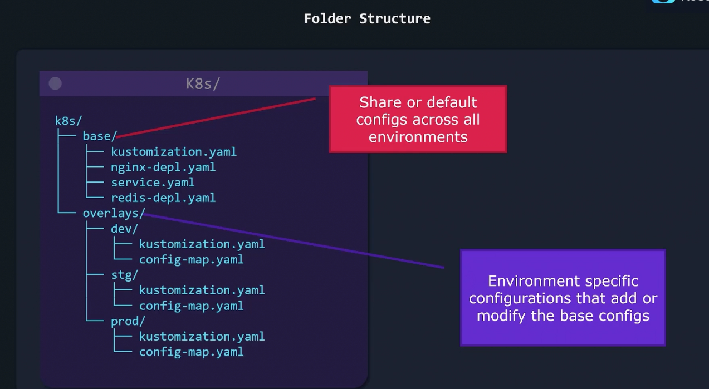
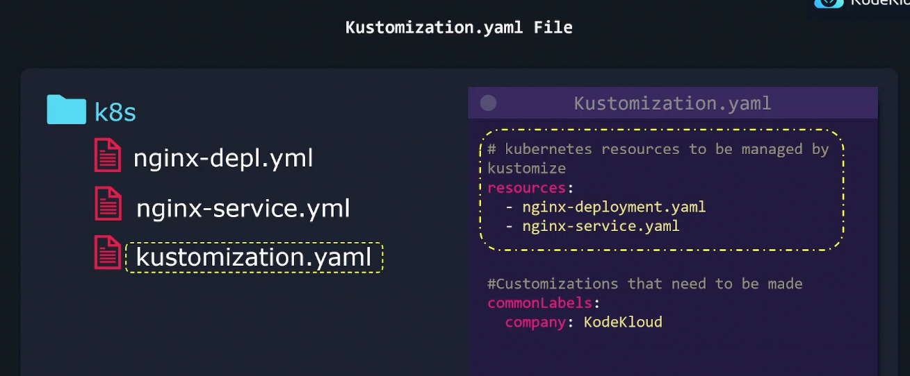
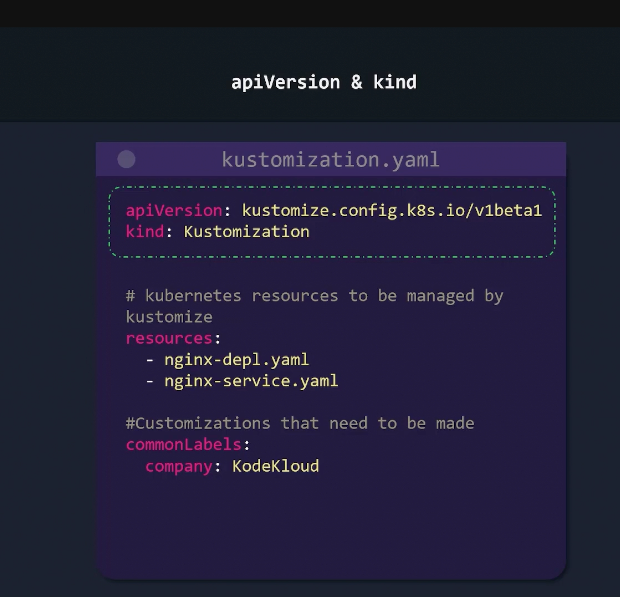
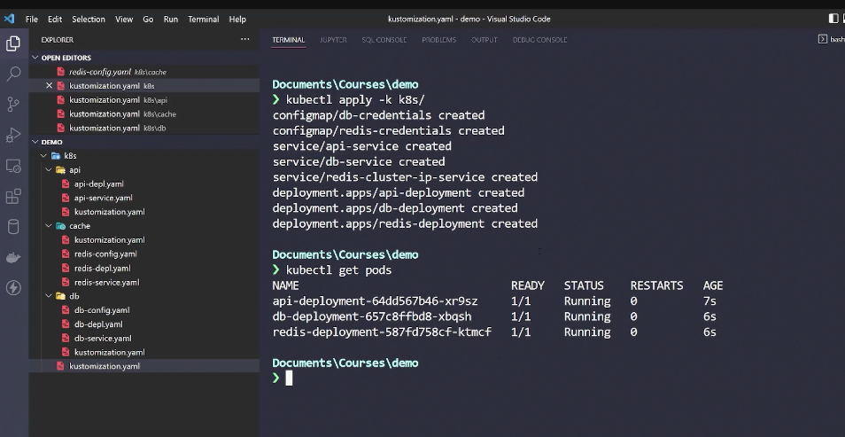

kustomize
-- for customizing environments 

    Overlays: |
--------------|--------------------------------------
- base 
    -[overlays/dev]
                        [overlays/prod]
    -[overlays/stg]


Folder structure 
k8s



--installation/setup



```bash
kustomize version --short

kustomize build k8s/ | kubectl apple -f - 

# delete
kustomize build k8s/ | kubectl delete -f - 
```






