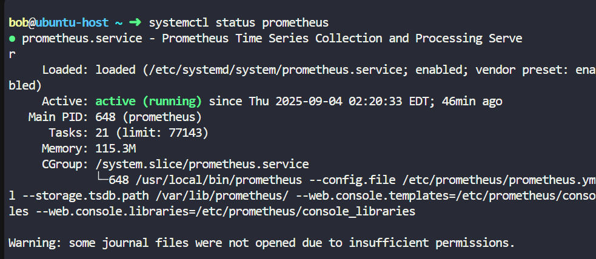
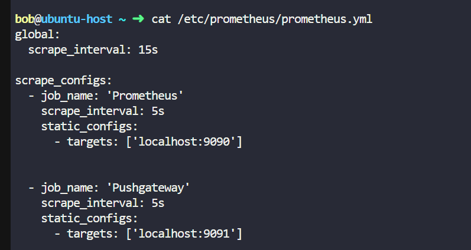
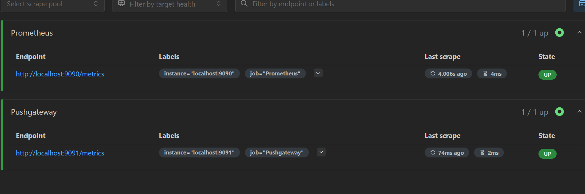
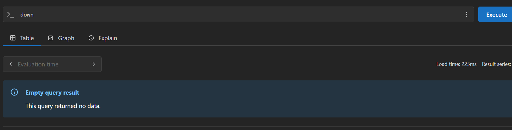
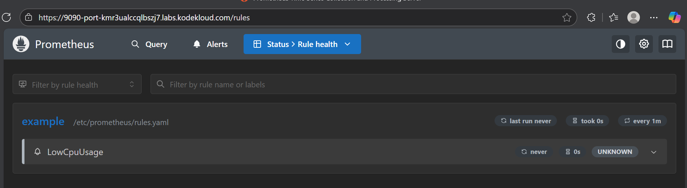
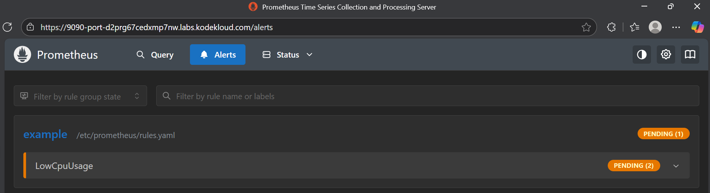
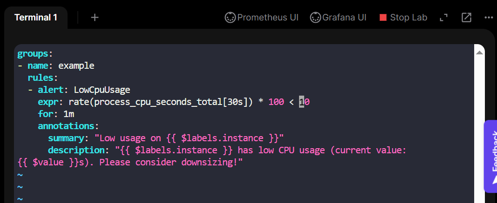
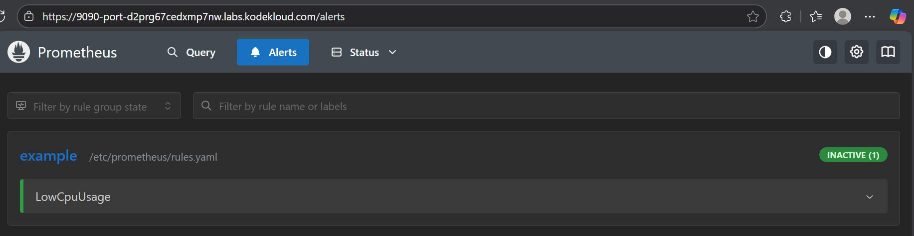

Part 1: Understanding the Prometheus Setup 
Perform the following checks to understand the current state of the Prometheus server. 
1. Check if Prometheus is running 
o Identify the appropriate command to verify the Prometheus process. 

2. Find the configuration file 
o Locate the full path to the Prometheus configuration file being used. 

/etc/prometheus/prometheus.yml

3. Locate the data directory 
o Identify the absolute path to where Prometheus stores its time series database. 

/var/lib/prometheus/ 

4. Check the default scrape interval 
o Look into the configuration file and determine how frequently Prometheus scrapes its 
targets by default. 

current scrape_interval:5s

5. Review the current scrape targets 
o Identify the targets Prometheus is currently scraping. 

6. Check for unhealthy targets 
o Open the Prometheus UI and inspect how many targets are in an unhealthy state.

7. cpu usage 

cpu_usage{instance="localhost:9091" ,  job = "Pushgateway"}

8. 

memory_usage{instance="localhost:9091" ,  job = "Pushgateway"}

9. 

10. 

11

12

13.

